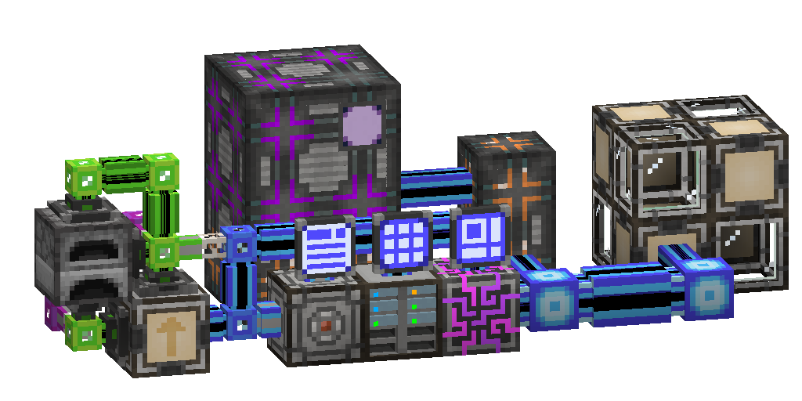

---
navigation:
  parent: ae2-mechanics/ae2-mechanics-index.md
  title: Autocrafting
  icon: pattern_provider
---
# Autocrafting
# The Big One

Autocrafting is one of the primary functions of AE2. Instead of manually having to craft the correct number of each sub-ingredient
like some sort of *plebian*, you can ask your ME system to do it for you. Or automatically craft items and export them somewhere.
Or automatically keep certain amounts of items in stock through clever emergent behavior. It also works with fluids, and, if you have
certain addons for extra mod material types, like Mekanism gasses, those materials too. It's pretty great.

It is quite a complex topic, so strap in and let's go.

An autocrafting setup consists of 3 things: the thing sending the crafting request, the crafting CPU, and the pattern provider.

1. Something creates a crafting request. This can be you in the terminal clicking on something autocraftable,
or an export bus or interface with a crafting card requesting one of the item they're set to export/stock.
   
- (**IMPORTANT:** middle-click to request crafts of something you already have in stock, this can conflict with inventory sorting mods),

2. The ME system calculates the required ingredients and prerequisite crafting steps to fulfill the request, and stores them in a crafting CPU

3. The pattern provider with the relevant <ItemLink id="crafting_pattern" /> or <ItemLink id="processing_pattern" /> pushes the ingredients specified in the pattern to any adjacent inventory.
In the case of a crafting table recipe (a "crafting pattern") this will be a <ItemLink id="molecular_assembler" />.
In the case of a non-crafting recipe (a "processing pattern") this will be some other block or machine or elaborate redstone-controlled setup.

4. The result of the craft is returned to the system somehow, be it by import bus, interface, or pushing the result back into a pattern provider.

5. If that craft is a prerequisite for another craft in the request, the items are stored in that crafting CPU and then used in that craft.

# Patterns

Patterns are made in a <ItemLink id="pattern_encoding_terminal" /> out of <ItemLink id="blank_pattern" />.

There are several different types of pattern for different things:

- Crafting patterns encode recipes made by a crafting table. They can be put directly in a <ItemLink id="molecular_assembler" /> to make it
craft the result whenever given the ingredients, but their main use is in a <ItemLink id="pattern_provider" /> next to a molecular assembler.
Pattern providers have special behavior in this case, and will send the relevant pattern along with the ingredients to adjacent assemblers.
Since assemblers auto-eject the results of crafts to adjacent inventories, an assembler on a pattern provider is all that is needed to automate crafting patterns.

- Smithing patterns are very similar to crafting patterns, but they encode smithing table recipes. They are also automated by a pattern
provider and molecular assembler, and function in the exact same way. In fact, crafting, smithing, and stonecutting patterns can be
used in the same setup.

- Stonecutting patterns are very similar to crafting patterns, but they encode stonecutter recipes. They are also automated by a pattern
  provider and molecular assembler, and function in the exact same way. In fact, crafting, smithing, and stonecutting patterns can be
  used in the same setup.

- Processing patterns are where a lot of flexibility in autocrafting comes from. They are the most generalized type, simply
saying "if a pattern provider pushes these ingredients to adjacent inventories, the ME system will recieve these items at some point in the
near or distant future". They are how you will autocraft with almost any modded machine, or furnaces and the like. Because they are so
general in use and do not care what happens between pushing ingredients and receiving the result, you can do some really funky stuff, like inputting 
the ingredients into an entire complex factory production chain which will sort out stuff, take in other ingredients from infinitely-producing
farms, print the entirety of the Bee Movie script, the ME system does not care as long as it gets the result the pattern specifies.

# The Crafting CPU

Crafting CPUs manage crafting requests/jobs. They store the intermediate ingredients while crafting jobs with multiple steps are
being carried out, and affect how big jobs can be, and to some degree how fast they are completed. They are multiblocks, and
must be rectangular prisms.

Crafting CPUs are made out of:
- [Crafting storages](./items-blocks-machines/crafting-storages.md), available in all the standard cell sizes (1k, 4k, 16k, 64k, 256k). They store the ingredients and
intermediate ingredients involved in a craft, so larger or more storages are required for the CPU to handle crafting jobs
with more ingredients.
- <ItemLink id="crafting_accelerator" />s, they make the system send out more ingredient batches from pattern providers.
This allows, say, a pattern provider surrounded by 6 molecular assemblers to send ingredients to (and thus use) all 6 at once instead of just one.
- <ItemLink id="crafting_monitor" />s, they display the job the CPU is handling at the moment.
- <ItemLink id="crafting_unit" />s, they simply fill space in order to make the CPU a rectangular prism.

Each crafting CPU handles 1 request or job, so if you want to request both a calculation processor and 256 smooth stone at once, you need 2 CPU multiblocks.

They can be set to handle requests from players, automation (export busses and interfaces), or both.

# Pattern Providers

