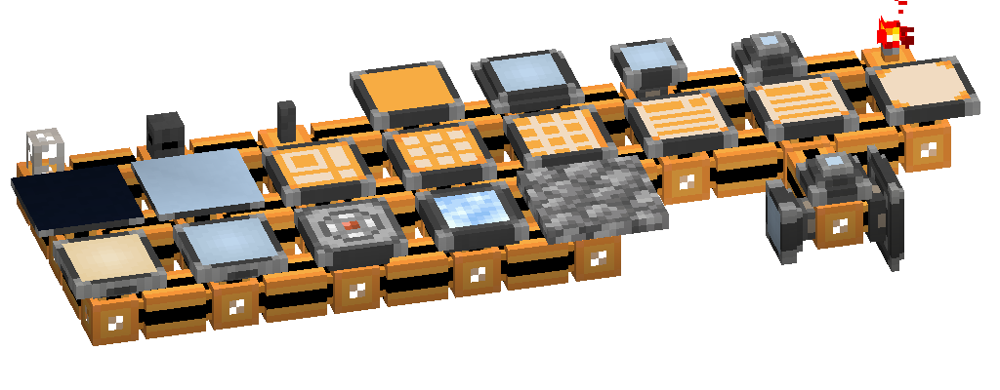

---
navigation:
  parent: ae2-mechanics/ae2-mechanics-index.md
  title: Cable Subparts
icon: fluix_glass_cable
---
# Cable Subparts

In AE2, certain devices and components can be placed on cables in the same block. This is useful for compact setups.
Shift-right-clicking with a <ItemLink id="certus_quartz_wrench"/> or <ItemLink id="network_tool"/> can break a single
subpart (or the cable) off without breaking everything in that block.