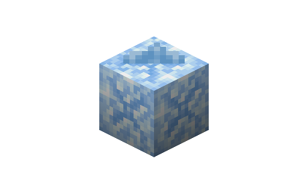
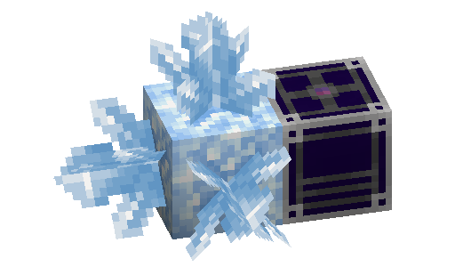

---
navigation:
  parent: ae2-mechanics/ae2-mechanics-index.md
  title: Farming Certus
  icon: quartz_cluster
---
# Farming Certus
# Basically just copy-pasted from the getting started page

Certus quartz buds will sprout from [budding certus blocks](../items-blocks-machines/budding_certus.md), similar to amethyst. If you break a bud that is not finished 
growing, it will drop one <ItemLink id="certus_quartz_dust" />, unchanged by fortune. If you break a fully grown cluster, it will drop four
<ItemLink id="certus_quartz_crystal" />s, and fortune will increase this number.

There are 4 tiers of budding certus blocks: Flawless, Flawed, Chipped, and Damaged.

Every time a bud grows by another stage, the budding block has a chance to degrade by one tier, eventually turning into 
a plain certus quartz block. They can be repaired (and new budding blocks created) by throwing the budding block (or a 
certus quartz block) in water with one or more <ItemLink id="charged_certus_quartz_crystal" />. 

<RecipeFor id="damaged_budding_quartz" />

Flawless budding certus blocks will not degrade and will generate certus infinitely. However they cannot be crafted or moved
with a pickaxe, even with silk touch. (they *can* be moved with [spatial storage](../ae2-mechanics/spatial-io.md) though)

By themselves, certus quartz buds grow very slowly. Luckily the <ItemLink id="quartz_growth_accelerator" /> massively 
accelerates this process when placed adjacent to the budding block. You should build a few of these as your first priority.

If you don't have enough quartz to also make an <ItemLink id="energy_acceptor" /> or <ItemLink id="vibration_chamber" />, 
you can make a <ItemLink id="crank" /> and stick it on the end of your accelerator.

Harvesting the certus automatically is "left as an exercise for the reader". (as a hint, <ItemLink id="annihilation_plane" />s and <ItemLink id="storage_bus" />ses are involved)