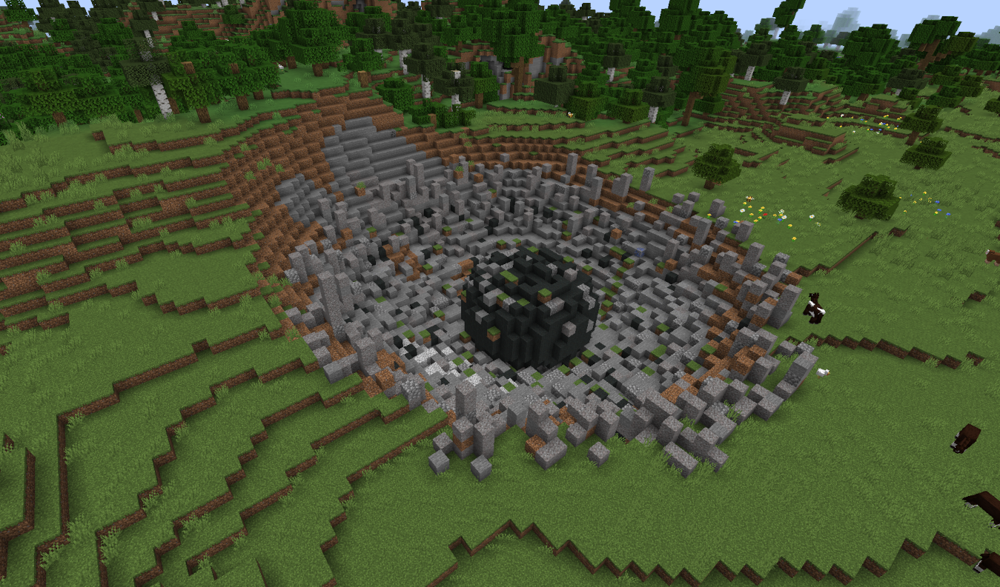

---
navigation:
  parent: ae2-mechanics/ae2-mechanics-index.md
  title: Meteorites
  icon: sky_stone_block
---

# Meteorites

<GameScene zoom="4" background="transparent">
  <ImportStructure src="../assets/assemblies/meteor_interior.snbt" />
</GameScene>

Meteorites are the starting point for using AE2. They provide critical materials: [budding certus blocks](../items-blocks-machines/budding_certus.md)
of various types and a <ItemLink id="mysterious_cube" /> in the center.

[Getting Started](../getting-started.md) will provide info on what to do once you find one.

## Finding Meteorites

Meteorites are fairly common and leave massive holes in the ground, so you may have already found a few. if not, a
<ItemLink id="meteorite_compass" /> will point toward the nearest mysterious cube.

