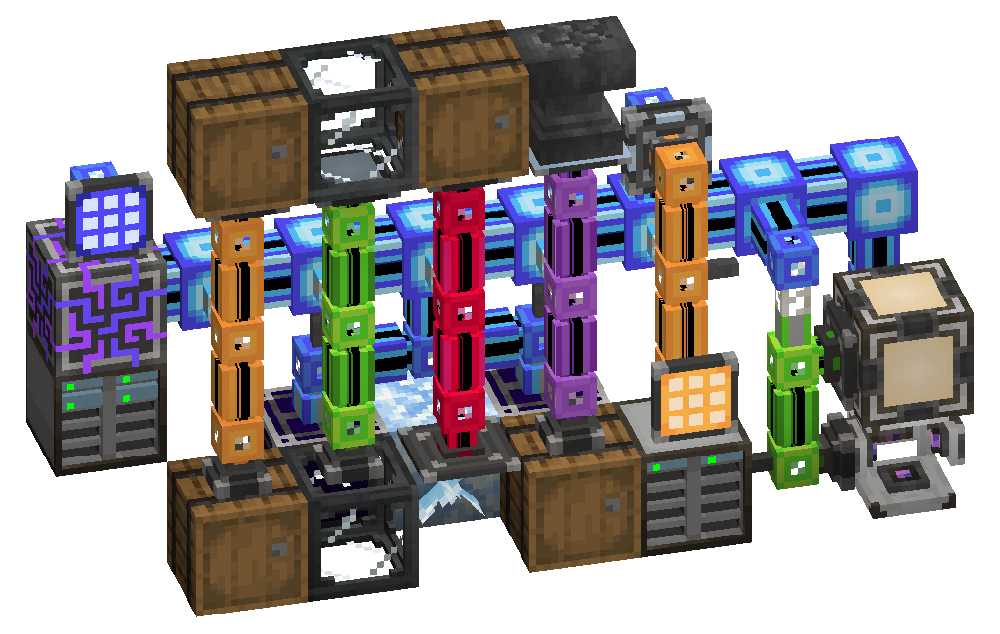

---
navigation:
  parent: ae2-mechanics/ae2-mechanics-index.md
  title: Subnetworks
---
# Subnetworks

"Subnetwork" is a rather loosely-defined term, but one might say that a subnetwork is any network that supports your
main network or does some small task. They are typically small enough to not require controllers. Their main 2 uses tend to be:
- To restrict what devices have access to what (you don't want the import bus on a "pipe" subnet to have access to your main net
storage, or it will put the items in your storage cells instead of in the destination inventory).
- To save channels on your main network, like having a pattern provider output to an interface connected to several storage
busses on several machines, using 1 channel, instead of putting a pattern provider on each machine, using several channels.

They can be

- an import bus and storage bus set up to transfer items or fluids from one container to another like an item or fluid pipe
- an annihilation plane and storage bus, so that the only place the annihilation plane can put what it breaks is the storage bus, allowing you to filter the plane
- an interface and formation plane, so that whatever is inserted into the interface gets pushed to the formation plane and placed/dropped in the world
- a setup to automatically make certus quartz, regulated and controlled by a <ItemLink id="level_emitter"/> on the main network
- a specialized storage system accessible from the main network via the special storage-bus-on-interface interaction, in order to store the output of a farm without endlessly overflowing your main storage
- and so on

Very useful for making subnetworks is the <ItemLink id="quartz_fiber"/>. It transfers power between networks without
connecting them, allowing you to power subnets without needing to put energy acceptors and power cables everywhere