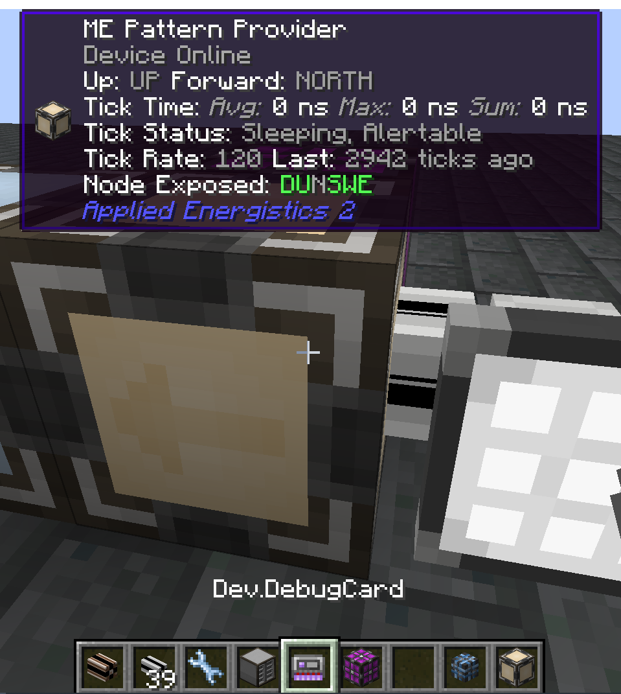

---
navigation:
  title: Debug Card
  icon: debug_card
item_ids:
  - ae2:debug_card
---

This page describes how to use the debug card to troubleshoot some issues.
You probably don't need to read this unless you are an AE2 developer / addon developer,
or we requested that you read it to help troubleshoot an issue, or you are curious about how AE2 works internally.

### Setup

You need to enable `unsupportedDeveloperTools` in the AE2 config.
Be very careful with some of these, there is a reason they are behind a config option containing **unsupported**.
The <ItemLink id="debug_card" /> item is reasonably safe to use, and you should give one to yourself and hold it in your main hand.

Also make sure that have installed WTHIT (Fabric) or Jade (Forge).

When looking at an AE2 block or part, you should seem something that looks like this:

### Node connectivity

The **Node Exposed** indicator highlights from which sides this device allows external connections.
That should match what is visible in world, otherwise it's a bug.

### Tick rates

To minimize lag, most ticking AE2 devices sleep when they have no work to do, and then they slowly "wake up" over time.
That is why import busses and export busses take a while to reach their maximum speed.
This information is visible in the debug information display:

#### Tick Status

- **Sleeping**: the device is currently sleeping, i.e. not going to do anything until it is awakened.
- **Awake**: the device is not sleeping, i.e. it should have some work scheduled.
- **Alertable**: the device is allowed to go from sleeping to awake if it wants.
- **Queued**: the device definitely has some work scheduled for later.

**If a device is awake, but not queued, it's a bug!**

#### Tick Rate

The "current speed" of the device, i.e. how many game ticks (1 tick = 0.05s) it waits before two actions.
This should go down as the device wakes up, and then back up when the device has no work to do.

#### Last

The last time the device was ticked.

**If a device is awake, but the last tick happened longer ago than the tick rate should allow, it's a bug!**
