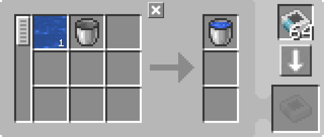
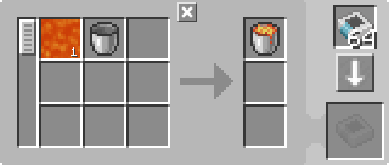

---
navigation:
  parent: example-setups/example-setups-index.md
  title: Bucket Filler
  icon: minecraft:water_bucket
---

# Bucket Filler

Also see [Bucket Emptier](bucket-emptier.md).

Note that since this uses a <ItemLink id="pattern_provider" />, it is meant to integrate into your [autocrafting](../ae2-mechanics/autocrafting.md)
setup.

Sometimes, life is inconvenient and you need buckets of a fluid instead of the fluid itself. Sometimes a machine might do this for you
(like the Fluid Transposer from Thermal Expansion), but you might not always have a mod that does it conveniently for you. Luckily
vanilla Minecraft has a slightly-less-convenient way, the <ItemLink id="minecraft:dispenser" />.

**Note that you often don't have to do this because Fluid Substitutions in a
[Pattern Encoding Terminal](../items-blocks-machines/terminals.md#pattern-encoding-terminal) allow you to use the fluid itself in
a crafting recipe instead of a bucket.**

<GameScene zoom="6" interactive={true}>
  <ImportStructure src="../assets/assemblies/bucket_filler.snbt" />

<BoxAnnotation color="#dddddd" min="2 1 0" max="3 2 1">
        (1) Pattern Provider: Set to lock crafting "With redstone signal", with the relevant processing patterns.

        <Row>
        
        
        </Row>
  </BoxAnnotation>

<BoxAnnotation color="#dddddd" min="3 1.1 0.1" max="3.2 1.9 0.9">
        (2) Interface: In its default configuration.
  </BoxAnnotation>

<BoxAnnotation color="#dddddd" min="3.1 1.1 0.8" max="3.9 1.9 1">
        (3) Storage Bus #1: In its default configuration.
  </BoxAnnotation>

<BoxAnnotation color="#dddddd" min="4.05 1.05 0.8" max="4.95 1.95 1">
        (4) Formation Plane: Filtered to blacklist buckets, using an inverter card.
        <Row><ItemImage id="minecraft:bucket" scale="2" /><ItemImage id="inverter_card" scale="2" /></Row>
  </BoxAnnotation>

<BoxAnnotation color="#dddddd" min="3.2 2 1.2" max="3.8 2.2 1.8">
        (5) Import Bus: Filtered to blacklist buckets, using an inverter card.
        <Row><ItemImage id="minecraft:bucket" scale="2" /><ItemImage id="inverter_card" scale="2" /></Row>
  </BoxAnnotation>

<BoxAnnotation color="#dddddd" min="2.1 2 0.1" max="2.9 2.2 0.9">
        (6) Storage Bus #2: In its default configuration.
  </BoxAnnotation>

<DiamondAnnotation pos="0 1.5 0.5" color="#00ff00">
        To Main Network
    </DiamondAnnotation>

  <IsometricCamera yaw="225" pitch="45" />
</GameScene>

## Configurations

* The <ItemLink id="pattern_provider" /> (1) is Set to lock crafting "With redstone signal", with the relevant <ItemLink id="processing_pattern" />s.
  
    
    

* The <ItemLink id="interface" /> (2) is in its default configuration.
* The first <ItemLink id="storage_bus" /> (3) is in its default configuration.
* The <ItemLink id="formation_plane" /> (4) is filtered to blacklist buckets, using an inverter card.
  <Row><ItemImage id="minecraft:bucket" scale="2" /><ItemImage id="inverter_card" scale="2" /></Row>
* The <ItemLink id="import_bus" /> (5) is filtered to blacklist buckets, using an inverter card.
  <Row><ItemImage id="minecraft:bucket" scale="2" /><ItemImage id="inverter_card" scale="2" /></Row>
* The second <ItemLink id="storage_bus" /> (6) is in its default configuration.

## How It Works

1. The <ItemLink id="pattern_provider" /> pushes the ingredients into the <ItemLink id="interface" />.
   (Actually, as an optimization, it pushes directly through the storage bus and formation plane as if they were extensions of the provider's faces. The items never actually enter the interface.)
2. Through mechanisms described in [pipe subnets](pipe-subnet.md#providing-to-multiple-places) and <ItemLink id="formation_plane" />,
   the bucket ends up in the <ItemLink id="minecraft:dispenser" /> and the fluid is placed by the formation plane.
3. The <ItemLink id="minecraft:comparator" /> detects the bucket in the dispenser and thus simultaneously powers the dispenser and locks
   the <ItemLink id="pattern_provider" />.
4. The dispenser scoops up the fluid with the bucket, it now has a filled bucket in itself.
5. The <ItemLink id="import_bus" /> pulls the filled bucket out of the dispenser and stores it through the
   <ItemLink id="storage_bus" /> into the pattern provider, returning it to the main network.
6. The comparator sees the dispenser is empty, unlocking the provider.
