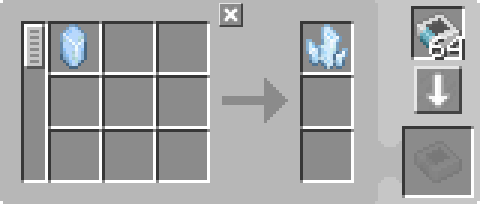

---
navigation:
  parent: example-setups/example-setups-index.md
  title: Charger Automation
  icon: charger
---

# Charger Automation

Note that since this uses a <ItemLink id="pattern_provider" />, it is meant to integrate into your [autocrafting](../ae2-mechanics/autocrafting.md)
setup. If you just want to automate a <ItemLink id="charger" /> standalone, use hoppers and chests and stuff.

Automation of a <ItemLink id="charger" /> is fairly simple. A <ItemLink id="pattern_provider" /> pushes the ingredient into the charger, then a [pipe subnet](pipe-subnet.md)
or other item pipe pushes the result back into the provider.

<GameScene zoom="6" interactive={true}>
  <ImportStructure src="../assets/assemblies/charger_automation.snbt" />

<BoxAnnotation color="#dddddd" min="1 0 0" max="2 1 1">
        (1) Pattern Provider: In its default configuration, with the relevant processing patterns. Also provides the charger with power.

        
  </BoxAnnotation>

<BoxAnnotation color="#dddddd" min="0 1 0" max="1 1.3 1">
        (2) Import Bus: In its default configuration.
  </BoxAnnotation>

<BoxAnnotation color="#dddddd" min="1 1 0" max="2 1.3 1">
        (3) Storage Bus: In its default configuration.
  </BoxAnnotation>

<DiamondAnnotation pos="4 0.5 0.5" color="#00ff00">
        To Main Network
    </DiamondAnnotation>

  <IsometricCamera yaw="195" pitch="30" />
</GameScene>

## Configurations

* The <ItemLink id="pattern_provider" /> (1) is in its default configuration, with the relevant <ItemLink id="processing_pattern" />s.
  It also provides the <ItemLink id="charger" /> with [energy](../ae2-mechanics/energy.md) because it acts like a [cable](../items-blocks-machines/cables.md).
  
    

* The <ItemLink id="import_bus" /> (2) is in its default configuration.
* The <ItemLink id="storage_bus" /> (3) is in its default configuration.

## How It Works

1. The <ItemLink id="pattern_provider" /> pushes the ingredients into the <ItemLink id="charger" />.
2. The charger does its charging thing.
3. The <ItemLink id="import_bus" /> on the green subnet pulls the result out of the charger and attempts to store it in
   [network storage](../ae2-mechanics/import-export-storage.md).
4. The only storage on the green subnet is the <ItemLink id="storage_bus" />, which stores the resulting items in the pattern provider, returning them to the main network.
