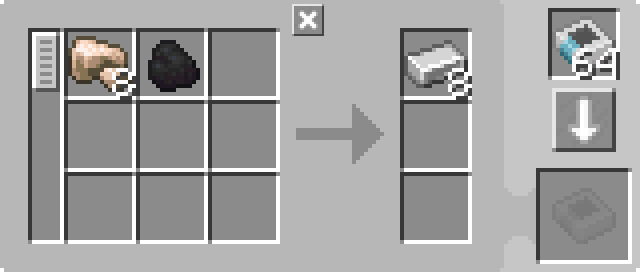

---
navigation:
  parent: example-setups/example-setups-index.md
  title: Furnace Automation
  icon: minecraft:furnace
---

# Furnace Automation

Note that since this uses a <ItemLink id="pattern_provider" />, it is meant to integrate into your [autocrafting](../ae2-mechanics/autocrafting.md)
setup. If you just want to automate a furnace standalone, use hoppers and chests and stuff.

Automation of a <ItemLink id="minecraft:furnace" /> is a bit more complex than automation of simpler machines like a [charger](../example-setups/charger-automation.md).
A furnace requires input from two separate sides, and extraction from a third. The item to be smelted must be pushed in the top face,
the fuel must be pushed in a side face, and the result must be pulled out the bottom. 

This could be done via a <ItemLink id="pattern_provider" />
on the top, an <ItemLink id="export_bus" /> on the side to constantly push in fuel, and an <ItemLink id="import_bus" /> on
the bottom to import the results into the network. However, this uses 3 [channels](../ae2-mechanics/channels.md).

Here's how you can do it with just 1 channel:

<GameScene zoom="6" interactive={true}>
  <ImportStructure src="../assets/assemblies/furnace_automation.snbt" />

<BoxAnnotation color="#dddddd" min="1 0 0" max="2 1 1">
        (1) Pattern Provider: The directional variant, via use of a certus quartz wrench, with the relevant processing patterns.

        
  </BoxAnnotation>

<BoxAnnotation color="#dddddd" min="1 1 0" max="2 1.3 1">
        (2) Interface: In its default configuration.
  </BoxAnnotation>

<BoxAnnotation color="#dddddd" min="1 1 0" max="1.3 2 1">
        (3) Storage Bus #1: Filtered to coal.
        <ItemImage id="minecraft:coal" scale="2" />
  </BoxAnnotation>

<BoxAnnotation color="#dddddd" min="0 2 0" max="1 2.3 1">
        (4) Storage Bus #2: Filtered to blacklist coal, using an inverter card.
        <Row><ItemImage id="minecraft:coal" scale="2" /><ItemImage id="inverter_card" scale="2" /></Row>
  </BoxAnnotation>

<DiamondAnnotation pos="4 0.5 0.5" color="#00ff00">
        To Main Network
    </DiamondAnnotation>

  <IsometricCamera yaw="195" pitch="30" />
</GameScene>

## Configurations

* The <ItemLink id="pattern_provider" /> (1) is in its default configuration, with the relevant <ItemLink id="processing_pattern" />s.
    It is made directional by using a <ItemLink id="certus_quartz_wrench" /> on it.

  

* The <ItemLink id="interface" /> (2) is in its default configuration.
* The first <ItemLink id="storage_bus" /> (3) is filtered to coal, or whatever fuel you want to use.
* The second <ItemLink id="storage_bus" /> (4) is filtered to blacklist the fuel you're using, using an <ItemLink id="inverter_card" />.

## How It Works

1. The <ItemLink id="pattern_provider" /> pushes the ingredients into the <ItemLink id="interface" />.
   (Actually, as an optimization, it pushes directly through the storage busses as if they were extensions of the provider's faces. The items never actually enter the interface.)
2. The interface is set to store nothing, so it tries to push the ingredients into [network storage](../ae2-mechanics/import-export-storage.md).
3. The only storage on the green subnet is the <ItemLink id="storage_bus" />ses. The bus filtered to coal places the coal in the furnace's fuel slot through the side face.
    The bus filtered to NOT coal places the items to be smelted in the top slot, through the top face.
4. The furnace does its furnacey thing
5. The hopper pulls the results out the furnace's bottom, and places them in the provider's return slots, returning them to the main network.
