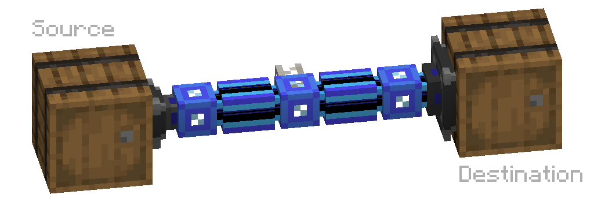
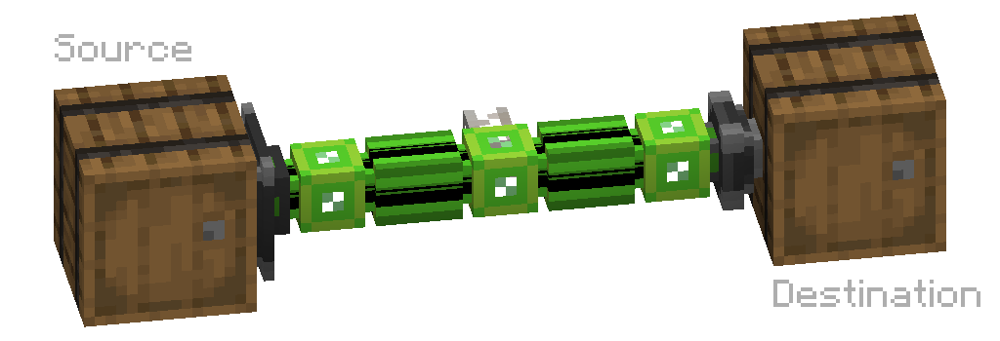
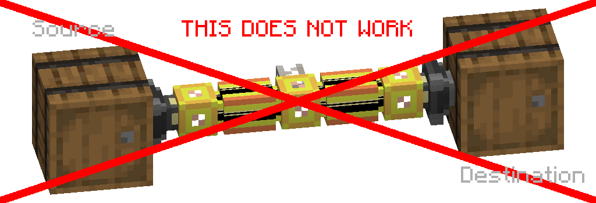
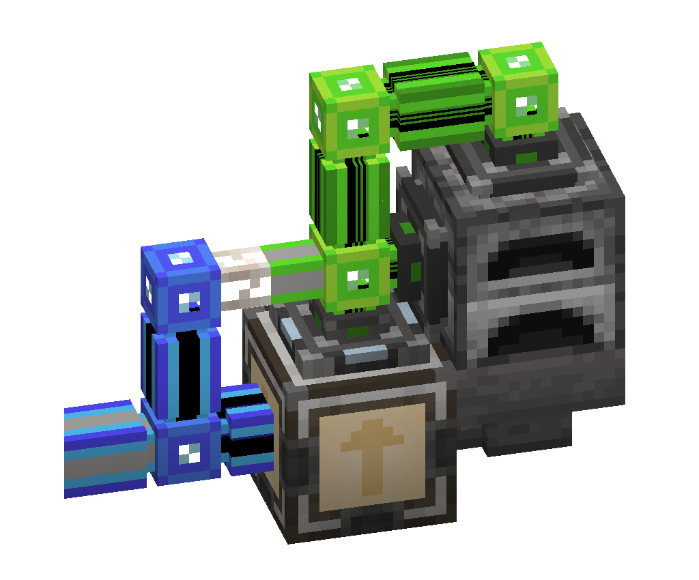

---
navigation:
  parent: example-setups/example-setups-index.md
  title: Item/Fluid "Pipe" Subnet
  icon: storage_bus
---
# Item/Fluid "Pipe" Subnet
A simple method of emulating an item and/or fluid pipe with AE2 devices, useful for, well, anything you'd use an item or fluid pipe for.
This includes returning the result of a craft to a <ItemLink id="pattern_provider"/>.

There are generally two different methods of achieving this:
# Import Bus -> Storage Bus

The <ItemLink id="import_bus"/> on the source inventory imports the items or fluid, and attempts to store them in [network storage](../ae2-mechanics/import-export-storage.md).
Since the only storage on the network is the <ItemLink id="storage_bus"/> (which is why this is a subnet and not on your main network), the items or fluid
are placed in the destination inventory, thus being transferred. Energy is provided through a <ItemLink id="quartz_fiber"/>.
Both the import bus and storage bus can be filtered, but the setup will transfer everything it can access if no filters are applied.
This setup also works with multiple import busses and multiple storage busses.

# Storage Bus -> Export Bus

The <ItemLink id="export_bus"/> on the destination inventory attempts to pull items in its filter from [network storage](../ae2-mechanics/import-export-storage.md).
Since the only storage on the network is the <ItemLink id="storage_bus"/> (which is why this is a subnet and not on your main network), the items or fluid
are pulled from the source inventory, thus being transferred. Energy is provided through a <ItemLink id="quartz_fiber"/>.
Because export busses must be filtered to function, this setup only operates if you filter the export bus.
This setup also works with multiple storage busses and multiple export busses.

# A Setup That Does Not Work (Import Bus -> Export Bus)

A setup with just an import and export bus will not work. The import bus will attempt to pull from the source inventory
and store the items or fluid in network storage. The export bus will attempt to pull from network storage and put the
items or fluid in the destination inventory. However since this network **has no storage**, the import bus can't import
and the export bus can't export, so nothing happens.

# A Pipe-Like Subnet

It turns out there are devices besides import busses that push items into [network storage](../ae2-mechanics/import-export-storage.md)!
Of relevance here is the <ItemLink id="interface"/>. If an item is inserted that the interface is not set to stock, the interface will
push it to network storage, which we can exploit similarly to the import bus -> storage bus pipe. This setup is of particular
utility with a <ItemLink id="pattern_provider"/> since an import bus can't extract recipe ingredients from it. Just make sure
the provider is in directional or flat subpart mode and/or the interface is in flat subpart mode, so the two don't form a network
connection.