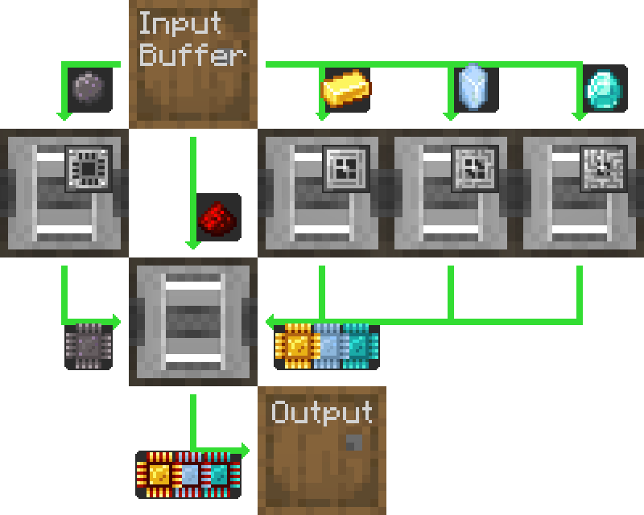
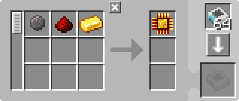
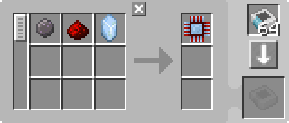
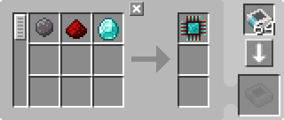
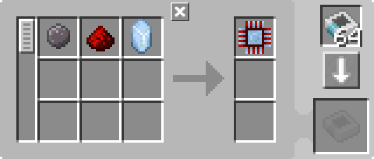

---
navigation:
  parent: example-setups/example-setups-index.md
  title: Processor Automation
  icon: logic_processor
---

# Automation of Processor Production

There are many ways of automating [processors](../items-blocks-machines/processors.md), and this is one of them.

This general layout can be done with any type of item logistics pipe or conduit or duct or whatever the mod calls it, as
long as you can filter it.

Here is detailed how to do it with just AE2, using ["pipe" subnets](pipe-subnet.md).

Note that since this uses a <ItemLink id="pattern_provider" />, it is meant to integrate into your [autocrafting](../ae2-mechanics/autocrafting.md)
setup. If you just want to automate a processors standalone, replace the pattern provider with another barrel, and directly put the ingredients in the upper barrel.

This happens to be backwards-compatible
with previous AE2 versions, because even if the <ItemLink id="inscriber" />s are sided, the pipe subnets still insert to and
extract from the correct faces.

## A Lesson In Pattern Encoding

Often, the [pattern](../items-blocks-machines/patterns.md) you need to encode **WILL NOT MATCH WHAT YOU SEE IN JEI**, or what JEI outputs when you click the + button.
In this case, JEI will output 2 separate patterns, one for the printed components and one for the final assembly, and the printed
components pattern will include a [press](../items-blocks-machines/presses.md). This is not what we want, because this is not what the setup will do. We want 1 pattern that
inputs the raw resources and outputs the completed processor, and since the press is already in the inscriber, we should not put it in the pattern.

---

<GameScene zoom="4" interactive={true}>
  <ImportStructure src="../assets/assemblies/processor_automation.snbt" />

  <BoxAnnotation color="#dddddd" min="5 1 0" max="6 2 1" thickness=".05">
        (1) Pattern Provider: In its default configuration, with the relevant processing patterns.

        <Row>
            
            
            
        </Row>
  </BoxAnnotation>

  <BoxAnnotation color="#dddddd" min="4.7 2 0" max="5 3 1" thickness=".05">
        (2) Storage Bus #1: In its default configuration.
  </BoxAnnotation>

  <BoxAnnotation color="#dddddd" min="4 1 0" max="4.3 2 1" thickness=".05">
        (3) Export Bus #1: Filtered to Silicon, has 2 Acceleration Cards
        <Row><ItemImage id="silicon" scale="2" /> <ItemImage id="speed_card" scale="2" /></Row>
  </BoxAnnotation>

  <BoxAnnotation color="#dddddd" min="4 4 0" max="4.3 3 1" thickness=".05">
        (4) Export Bus #2: Filtered to Gold Ingot, has 2 Acceleration Cards
        <Row><ItemImage id="minecraft:gold_ingot" scale="2" /> <ItemImage id="speed_card" scale="2" /></Row>
  </BoxAnnotation>

  <BoxAnnotation color="#dddddd" min="4 5 0" max="4.3 4 1" thickness=".05">
        (5) Export Bus #3: Filtered to Certus Quartz Crystal, has 2 Acceleration Cards
        <Row><ItemImage id="certus_quartz_crystal" scale="2" /> <ItemImage id="speed_card" scale="2" /></Row>
  </BoxAnnotation>

  <BoxAnnotation color="#dddddd" min="4 6 0" max="4.3 5 1" thickness=".05">
        (6) Export Bus #4: Filtered to Diamond, has 2 Acceleration Cards
        <Row><ItemImage id="minecraft:diamond" scale="2" /> <ItemImage id="speed_card" scale="2" /></Row>
  </BoxAnnotation>

  <BoxAnnotation color="#dddddd" min="2.3 3 0" max="2 2 1" thickness=".05">
        (7) Export Bus #5: Filtered to Redstone Dust, has 2 Acceleration Cards
        <Row><ItemImage id="minecraft:redstone" scale="2" /> <ItemImage id="speed_card" scale="2" /></Row>
  </BoxAnnotation>

  <BoxAnnotation color="#dddddd" min="4 1 0" max="3 2 1" thickness=".05">
        (8) Inscriber #1: In its default configuration. Has a Silicon Press and 4 Acceleration Cards
        <Row><ItemImage id="silicon_press" scale="2" /> <ItemImage id="speed_card" scale="2" /></Row>
  </BoxAnnotation>

  <BoxAnnotation color="#dddddd" min="4 3 0" max="3 4 1" thickness=".05">
        (9) Inscriber #2: In its default configuration. Has a Logic Press and 4 Acceleration Cards
        <Row><ItemImage id="logic_processor_press" scale="2" /> <ItemImage id="speed_card" scale="2" /></Row>
  </BoxAnnotation>

  <BoxAnnotation color="#dddddd" min="4 4 0" max="3 5 1" thickness=".05">
        (10) Inscriber #3: In its default configuration. Has a Calculation Press and 4 Acceleration Cards
        <Row><ItemImage id="calculation_processor_press" scale="2" /> <ItemImage id="speed_card" scale="2" /></Row>
  </BoxAnnotation>

  <BoxAnnotation color="#dddddd" min="4 5 0" max="3 6 1" thickness=".05">
        (11) Inscriber #4: In its default configuration. Has an Engineering Press and 4 Acceleration Cards
        <Row><ItemImage id="engineering_processor_press" scale="2" /> <ItemImage id="speed_card" scale="2" /></Row>
  </BoxAnnotation>

  <BoxAnnotation color="#dddddd" min="2 2 0" max="1 3 1" thickness=".05">
        (12) Inscriber #5: In its default configuration. Has 4 Acceleration Cards
        <ItemImage id="speed_card" scale="2" />
  </BoxAnnotation>

  <BoxAnnotation color="#dddddd" min="2.7 2 0" max="3 1 1" thickness=".05">
        (13) Import Bus #1: In its default configuration, has 2 Acceleration Cards
        <ItemImage id="speed_card" scale="2" />
  </BoxAnnotation>

  <BoxAnnotation color="#dddddd" min="2.7 4 0" max="3 3 1" thickness=".05">
        (14) Import Bus #2: In its default configuration, has 2 Acceleration Cards
        <ItemImage id="speed_card" scale="2" />
  </BoxAnnotation>

  <BoxAnnotation color="#dddddd" min="2.7 5 0" max="3 4 1" thickness=".05">
        (15) Import Bus #3: In its default configuration, has 2 Acceleration Cards
        <ItemImage id="speed_card" scale="2" />
  </BoxAnnotation>

  <BoxAnnotation color="#dddddd" min="2.7 6 0" max="3 5 1" thickness=".05">
        (16) Import Bus #4: In its default configuration, has 2 Acceleration Cards
        <ItemImage id="speed_card" scale="2" />
  </BoxAnnotation>

  <BoxAnnotation color="#dddddd" min="2 3 0" max="1 3.3 1" thickness=".05">
        (17) Storage Bus #2: In its default configuration.
  </BoxAnnotation>

  <BoxAnnotation color="#dddddd" min="2 1.7 0" max="1 2 1" thickness=".05">
        (18) Storage Bus #3: In its default configuration.
  </BoxAnnotation>

  <BoxAnnotation color="#dddddd" min="1 2 0" max="0.7 3 1" thickness=".05">
        (19) Import Bus #5: In its default configuration, has 2 Acceleration Cards
        <ItemImage id="speed_card" scale="2" />
  </BoxAnnotation>

  <BoxAnnotation color="#dddddd" min="5 0.7 0" max="6 1 1" thickness=".05">
        (20) Storage Bus #4: In its default configuration.
  </BoxAnnotation>

<BoxAnnotation color="#dddddd" min="3.3 2.7 0.3" max="3.7 3 0.7" thickness=".05">
        Quartz Fiber powers all 3 inscribers because inscribers act like cables and thus transmit energy
  </BoxAnnotation>

<DiamondAnnotation pos="7 1.5 0.5" color="#00ff00">
        To Main Network
    </DiamondAnnotation>

  <IsometricCamera yaw="185" pitch="5" />
</GameScene>

## Configurations

* The <ItemLink id="pattern_provider" /> (1) is in its default configuration, with the relevant <ItemLink id="processing_pattern" />s.
  Note that the patterns go direct from raw resources to the completed processor, and do **NOT** include the [press](../items-blocks-machines/presses.md).

  
  
  

* The <ItemLink id="storage_bus" />ses (2, 17, 18, 20) are in their default configurations.
* The <ItemLink id="export_bus" />ses (3-7) are filtered to the relevant ingredient. They have 2 <ItemLink id="speed_card" />s.
    <Row>
      <ItemImage id="silicon" scale="2" />
      <ItemImage id="minecraft:gold_ingot" scale="2" />
      <ItemImage id="certus_quartz_crystal" scale="2" />
      <ItemImage id="minecraft:diamond" scale="2" />
      <ItemImage id="minecraft:redstone" scale="2" />
    </Row>
* The <ItemLink id="import_bus" />ses (13-16, 19) are in their default configurations. They have 2 <ItemLink id="speed_card" />s.
* The <ItemLink id="inscriber" />s are in their default configurations. They have the relevant [press](../items-blocks-machines/presses.md),
   and 4 <ItemLink id="speed_card" />s.
   <Row>
     <ItemImage id="silicon_press" scale="2" />
     <ItemImage id="logic_processor_press" scale="2" />
     <ItemImage id="calculation_processor_press" scale="2" />
     <ItemImage id="engineering_processor_press" scale="2" />
   </Row>

## How It Works

1. The <ItemLink id="pattern_provider" /> pushes the ingredients into the barrel.
2. The first [pipe subnet](pipe-subnet.md) (orange) pulls the silicon, redstone dust, and the relevant processor's ingredient
   (Gold Ingot, Certus Quartz Crystal, or Diamond) out of the barrel and puts them in the relevant <ItemLink id="inscriber" />.
3. The first four <ItemLink id="inscriber" />s make the <ItemLink id="printed_silicon" />, and the <ItemLink id="printed_logic_processor" />,
   <ItemLink id="printed_calculation_processor" />, or <ItemLink id="printed_engineering_processor" />.
4. The second and third [pipe subnet](pipe-subnet.md)s (green) take the printed circuits out of the first four <ItemLink id="inscriber" />s
    and put them in the fifth, final assembly <ItemLink id="inscriber" />.
5. The fifth <ItemLink id="inscriber" /> assembles the [processor](../items-blocks-machines/processors.md).
6. The fourth [pipe subnet](pipe-subnet.md) (purple) puts the prcoessor in the pattern provider, returning it to the main network.