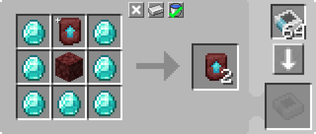

---
navigation:
  parent: example-setups/example-setups-index.md
  title: Recursive Crafting
  icon: minecraft:netherite_upgrade_smithing_template
---

# A Recursive Crafting Setup

As stated in [autocrafting](../ae2-mechanics/autocrafting.md), the autocrafting planning algorithm cannot handle recipes where
the primary output is one of the inputs. For example, it cannot handle cloning <ItemLink id="minecraft:netherite_upgrade_smithing_template" />s.

One solution is use of a <ItemLink id="level_emitter" />'s ability to pretend to be a [pattern](../items-blocks-machines/patterns.md).

This will then be used to turn on a little setup that constantly performs the craft. In this case, we will look at a setup
to clone <ItemLink id="minecraft:netherite_upgrade_smithing_template" />s.

<RecipeFor id="minecraft:netherite_upgrade_smithing_template" />

***

<GameScene zoom="6" interactive={true}>
  <ImportStructure src="../assets/assemblies/recursive_recipe_setup.snbt" />

  <BoxAnnotation color="#dddddd" min="1 0 0" max="2 1 1">
        (1) Interface: set to stock the required additional ingredients: diamond and netherrack.
        <Row><ItemImage id="minecraft:diamond" scale="2" /> <ItemImage id="minecraft:netherrack" scale="2" /></Row>
  </BoxAnnotation>

  <BoxAnnotation color="#dddddd" min="2.3 1 0.3" max="2.7 1.3 0.7">
        (2) Level Emitter: Configured with "netherite smithing template", set to "Emit Redstone to craft item".
        <Row><ItemImage id="minecraft:netherite_upgrade_smithing_template" scale="2" /> <ItemImage id="crafting_card" scale="2" /></Row>
  </BoxAnnotation>

  <BoxAnnotation color="#dddddd" min="2 0 0" max="2.3 1 1">
        (3) Import Bus #1: Filtered to the items the Interface is stocking. Has a Redstone Card. Redstone mode set to
        "Active with signal".
        <Row>
        <ItemImage id="minecraft:diamond" scale="2" />
        <ItemImage id="minecraft:netherrack" scale="2" />
        <ItemImage id="redstone_card" scale="2" />
        </Row>
  </BoxAnnotation>

  <BoxAnnotation color="#dddddd" min="3 1 1" max="4 1.3 2">
        (4) Storage Bus #1: Set to a higher priority than the other storage bus. VERY IMPORTANT.
  </BoxAnnotation>

  <BoxAnnotation color="#dddddd" min="3 0 1" max="4 1 2">
        (5) Molecular Assembler: Has in it the pattern for duplicating a smithing template.

        

        It also has one smithing template already inserted into it manually when you first build this.
  </BoxAnnotation>

  <BoxAnnotation color="#dddddd" min="2.7 0 1" max="3 1 2">
        (6) Import Bus #2: In its default configuration.
  </BoxAnnotation>

  <BoxAnnotation color="#dddddd" min="1 0 1" max="2 1 1.3">
        (7) Storage Bus #2: Filtered to "netherite smithing template". Set to a lower priority than the other storage bus.
        <ItemImage id="minecraft:netherite_upgrade_smithing_template" scale="2" />
  </BoxAnnotation>

<DiamondAnnotation pos="0 0.5 0.5" color="#00ff00">
        To Main Network
    </DiamondAnnotation>

  <IsometricCamera yaw="15" pitch="30" />
</GameScene>

## Configurations

* The <ItemLink id="interface" /> (1) is set to stock the required additional ingredients: diamond and netherrack.
* The <ItemLink id="level_emitter" /> (2) is configured with "netherite smithing template", and set to "Emit Redstone to craft item".
* The first <ItemLink id="import_bus" /> (3) is filtered to the items the Interface is stocking. It has a Redstone Card. The redstone mode is set to "Active with signal".
* The first <ItemLink id="storage_bus" /> (4) is set to a *higher* [priority](../ae2-mechanics/import-export-storage.md#storage-priority) than the second storage bus.
* The <ItemLink id="molecular_assembler" /> (5) has the pattern for duplicating the smithing template, and one smithing template already inserted manually.

  

* The second <ItemLink id="import_bus" /> (6) is in its default configuration.
* The second <ItemLink id="storage_bus" /> (7) is filtered to "netherite smithing template". It has a *lower* [priority](../ae2-mechanics/import-export-storage.md#storage-priority) than the first storage bus.

## How It Works

1. The <ItemLink id="level_emitter" /> pretends to be a [pattern](../items-blocks-machines/patterns.md) due to the inserted
   <ItemLink id="crafting_card" /> and being set to "Emit Redstone to craft item". Thus, "netherite smithing template" shows up in
   [terminals](../items-blocks-machines/terminals.md) as a valid thing to [autocraft](../ae2-mechanics/autocrafting.md).
2. When receiving a request to craft that item, either from a player or from the system itself, the level emitter turns on.
3. The first <ItemLink id="import_bus" /> is activated by the level emitter, and pulls out the ingredients stocked in the <ItemLink id="interface" />.
4. The only <ItemLink id="storage_bus" /> on the network that is able to store those ingredients is the one on the assembler.
5. The <ItemLink id="molecular_assembler" /> receives the ingredients (already having 1 smithing pattern inside), and performs the craft, producing 2 smithing patterns.
6. The second <ItemLink id="import_bus" /> extracts 1 smithing pattern.
7. The first storage bus has a higher priority, so that smithing pattern goes back into the assembler.
8. The second <ItemLink id="import_bus" /> extracts 1 smithing pattern.
9. The assembler cannot receive another smithing pattern, so the second smithing pattern goes to the lower priority storage bus, inserting it into the interface.
10. The <ItemLink id="interface" />, not being set to stock smithing patterns, inserts it into the network.