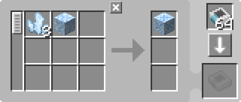
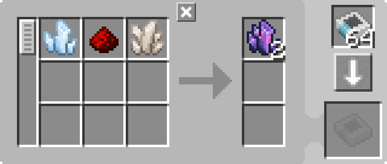
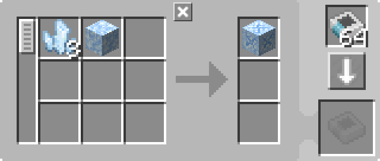

---
navigation:
  parent: example-setups/example-setups-index.md
  title: Throwing-In-Water Automation
  icon: fluix_crystal
---

# Automation of Throwing In Water recipes

Note that since this uses a <ItemLink id="pattern_provider" />, it is meant to integrate into your [autocrafting](../ae2-mechanics/autocrafting.md)
setup.

Some recipes require items to be thrown into water (though a similar setup can be used to throw items other places).
This can be automated with a <ItemLink id="formation_plane" />, <ItemLink id="annihilation_plane" />, and some supporting
infrastructure (this is essentially 2 modified [pipe subnets](pipe-subnet.md)).

This setup is meant to be used in combination with [charger automation](charger-automation.md) to provide the <ItemLink id="charged_certus_quartz_crystal" />s.

<GameScene zoom="6" interactive={true}>
  <ImportStructure src="../assets/assemblies/throw_in_water.snbt" />

<BoxAnnotation color="#dddddd" min="2 0 1" max="3 1 2">
        (1) Pattern Provider: In its default configuration, with the relevant processing patterns.

         
  </BoxAnnotation>

<BoxAnnotation color="#dddddd" min="1.7 0 1" max="2 1 2">
        (2) Interface: In its default configuration.
  </BoxAnnotation>

<BoxAnnotation color="#dddddd" min="1 .7 1" max="2 1 2">
        (3) Formation Plane: Set to drop inputs as items.
  </BoxAnnotation>

<BoxAnnotation color="#dddddd" min="1 2 1" max="2 2.3 2">
        (4) Annihilation Plane: No GUI to configure.
  </BoxAnnotation>

<BoxAnnotation color="#dddddd" min="2 1 1" max="3 1.3 2">
        (5) Storage Bus: Filtered to the outputs of the patterns
        <Row><ItemImage id="fluix_crystal" scale="2" /><BlockImage id="flawless_budding_quartz" scale="2" /></Row>
  </BoxAnnotation>

<DiamondAnnotation pos="3.9 0.5 1.5" color="#00ff00">
        To Main Network and Charger Automation
        <GameScene zoom="3" background="transparent">
          <ImportStructure src="../assets/assemblies/charger_automation.snbt" />
          <IsometricCamera yaw="195" pitch="30" />
        </GameScene>
    </DiamondAnnotation>

  <IsometricCamera yaw="180" pitch="0" />
</GameScene>

## Configurations and Patterns

* The <ItemLink id="pattern_provider" /> (1) is in its default configuration, with the relevant <ItemLink id="processing_pattern" />s
  * For <ItemLink id="fluix_crystal" /> the default recipe from JEI/REI works fine:

    

  * For <ItemLink id="flawed_budding_quartz" /> it's probably best to make it directly from <ItemLink id="quartz_block" />,
    which avoids issues with the input of one recipe being the output of another, causing the storage bus to not be able to filter:

    

* The <ItemLink id="interface" /> (2) is in its default configuration.
* The <ItemLink id="formation_plane" /> (3) is set to drop inputs as items.
* The <ItemLink id="annihilation_plane" /> (4) has no GUI and cannot be configured.
* The <ItemLink id="storage_bus" /> (5) is filtered to the outputs of the patterns.

## How It Works

1.  The <ItemLink id="pattern_provider" /> pushes the ingredients into the <ItemLink id="interface" /> on its side, on the green subnet
2.  The interface (being configured to not store anything by default) attempts to push its contents into [network storage](../ae2-mechanics/import-export-storage.md)
3.  The only storage on the green subnet is the <ItemLink id="formation_plane" />, which drops the items it receives into the water
4.  The <ItemLink id="annihilation_plane" /> on the orange subnet attempts to pick up the items that were just dropped, but cannot, because
    the <ItemLink id="storage_bus" /> on top of the pattern provider (the only storage on the orange subnet) is filtered to only accept the results of possible crafts
5.  The items perform their in-world transformation.
6.  The annihilation plane can now pick up the items in front of it, as the storage bus is allowed to store them.
7.  The storage bus stores the resulting items in the pattern provider, returning them to the network.
