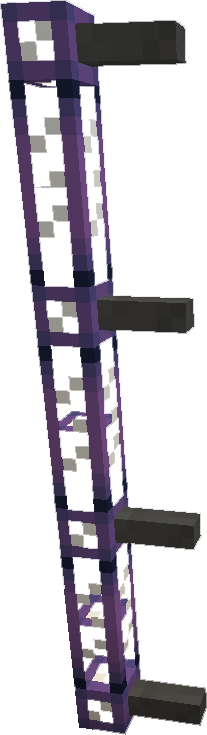

---
categories:
  - Decorative Blocks/Other Features
item_ids:
  - ae2:cable_anchor
navigation:
  title: Cable Anchor
---

Small decorative cable-mounted spikes that you can use to create ladders with cables, or make the cable appear
connected to the walls around it. Also used to craft <ItemLink id="facade"/>.

Cable anchors prevent connections from forming on the side they're mounted on.

<RecipeFor id="cable_anchor" />
