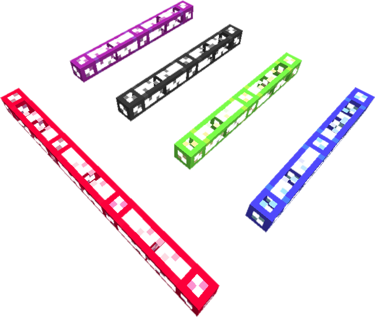
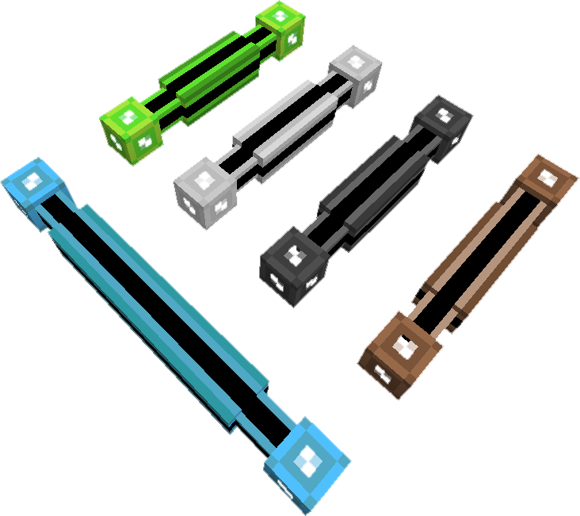

---
navigation:
  title: Cables
  icon: fluix_glass_cable
item_ids:
  - ae2:white_glass_cable
  - ae2:orange_glass_cable
  - ae2:magenta_glass_cable
  - ae2:light_blue_glass_cable
  - ae2:yellow_glass_cable
  - ae2:lime_glass_cable
  - ae2:pink_glass_cable
  - ae2:gray_glass_cable
  - ae2:light_gray_glass_cable
  - ae2:cyan_glass_cable
  - ae2:purple_glass_cable
  - ae2:blue_glass_cable
  - ae2:brown_glass_cable
  - ae2:green_glass_cable
  - ae2:red_glass_cable
  - ae2:black_glass_cable
  - ae2:fluix_glass_cable
  - ae2:white_covered_cable
  - ae2:orange_covered_cable
  - ae2:magenta_covered_cable
  - ae2:light_blue_covered_cable
  - ae2:yellow_covered_cable
  - ae2:lime_covered_cable
  - ae2:pink_covered_cable
  - ae2:gray_covered_cable
  - ae2:light_gray_covered_cable
  - ae2:cyan_covered_cable
  - ae2:purple_covered_cable
  - ae2:blue_covered_cable
  - ae2:brown_covered_cable
  - ae2:green_covered_cable
  - ae2:red_covered_cable
  - ae2:black_covered_cable
  - ae2:fluix_covered_cable
  - ae2:white_covered_dense_cable
  - ae2:orange_covered_dense_cable
  - ae2:magenta_covered_dense_cable
  - ae2:light_blue_covered_dense_cable
  - ae2:yellow_covered_dense_cable
  - ae2:lime_covered_dense_cable
  - ae2:pink_covered_dense_cable
  - ae2:gray_covered_dense_cable
  - ae2:light_gray_covered_dense_cable
  - ae2:cyan_covered_dense_cable
  - ae2:purple_covered_dense_cable
  - ae2:blue_covered_dense_cable
  - ae2:brown_covered_dense_cable
  - ae2:green_covered_dense_cable
  - ae2:red_covered_dense_cable
  - ae2:black_covered_dense_cable
  - ae2:fluix_covered_dense_cable
  - ae2:white_smart_cable
  - ae2:orange_smart_cable
  - ae2:magenta_smart_cable
  - ae2:light_blue_smart_cable
  - ae2:yellow_smart_cable
  - ae2:lime_smart_cable
  - ae2:pink_smart_cable
  - ae2:gray_smart_cable
  - ae2:light_gray_smart_cable
  - ae2:cyan_smart_cable
  - ae2:purple_smart_cable
  - ae2:blue_smart_cable
  - ae2:brown_smart_cable
  - ae2:green_smart_cable
  - ae2:red_smart_cable
  - ae2:black_smart_cable
  - ae2:fluix_smart_cable
  - ae2:white_smart_dense_cable
  - ae2:orange_smart_dense_cable
  - ae2:magenta_smart_dense_cable
  - ae2:light_blue_smart_dense_cable
  - ae2:yellow_smart_dense_cable
  - ae2:lime_smart_dense_cable
  - ae2:pink_smart_dense_cable
  - ae2:gray_smart_dense_cable
  - ae2:light_gray_smart_dense_cable
  - ae2:cyan_smart_dense_cable
  - ae2:purple_smart_dense_cable
  - ae2:blue_smart_dense_cable
  - ae2:brown_smart_dense_cable
  - ae2:green_smart_dense_cable
  - ae2:red_smart_dense_cable
  - ae2:black_smart_dense_cable
  - ae2:fluix_smart_dense_cable
  - ae2:toggle_bus
  - ae2:inverted_toggle_bus
---

While ME networks are also created by adjacent ME-capable machines, cables are the primary way of
extending an ME network over larger areas.

Differently colored cables can be used to ensure adjacent cables do not connected to each other,
allowing [channels](channels.md) to be distributed more efficiently.

## Glass Cable

<ItemLink id="fluix_glass_cable" /> is the simplest cable to make, transfers power
and up to 8 [Channels](channels.md). It comes in 17 diffrent colors, the default
being Fluix, and can be dyed any color using any of the 16 dyes.

To craft colored cables surround a dye of any type with 8 cables of the same
type ( color of the cables dosn't matter, but they must be the same type,
glass, smart, etc ). You can also paint cables with any forge compatible paint
brush in world.

You can craft any colored cable with a water bucket to remove the dye.

You can cover the cable with wool to create <ItemLink id="fluix_covered_cable"/>, and craft <ItemLink
id="fluix_smart_cable"/> to get a better idea of what is going on with
your [Channels](channels.md).

<RecipeFor id="fluix_glass_cable" />

## Covered Cable

The covered cable variant offers no gameplay benefits over its <ItemLink
id="fluix_glass_cable"/> counterpart. It can however be used
as an alternate aesthetic choice if you prefer the covered look.

Can be colored in the same manner as <ItemLink
id="fluix_glass_cable"/>. Four <ItemLink
id="fluix_covered_cable"/> can be crafted with
redstone and glowstone to make <ItemLink
id="fluix_covered_dense_cable"/>.

<RecipeFor id="fluix_covered_cable" />

## Dense Cable

Higher Capacity
cable, can carry 32 channels unlike standard cable which can only carry 8,
however it doesn't support buses so you must first step down from dense to a
smaller cable (such as <ItemLink
id="fluix_glass_cable"/> or <ItemLink
id="fluix_smart_cable"/>) before using buses or
panels. Shows load similarly to <ItemLink
id="fluix_smart_cable"/>, with each line lit
representing four channels in use.

<RecipeFor id="fluix_covered_dense_cable" />

## Smart Cable

While bearing some similarity to <ItemLink id="fluix_covered_cable"/> in appearance, they
provide diagnostic function by visualizing the channel usage on the cables,
the channels appear as lit colored lines that run along the black stripe on
the cables giving you an understanding of how your channels are being used on
your network. The first four channels show as lines matching the color of the
cable, the next four show as white lines.

These can also be colored in the same manner as <ItemLink
id="fluix_glass_cable"/>.

<RecipeFor id="fluix_smart_cable" />

## Toggle Bus

A bus which functions similarly to <ItemLink
id="fluix_glass_cable"/> or other cables, but it
allows its connection state to be toggled via redstone. This allows you to cut
off a section of a [ME Network](../me-network.md).

When redstone signal supplied the part enables the connection, <ItemLink
id="inverted_toggle_bus"/> provides the reverse
behavior by disabling the connection instead.

<RecipeFor id="toggle_bus" />

There is also an inverted version of the toggle bus that disables the connection
when a redstone signal is supplied.

<RecipeFor id="inverted_toggle_bus" />
