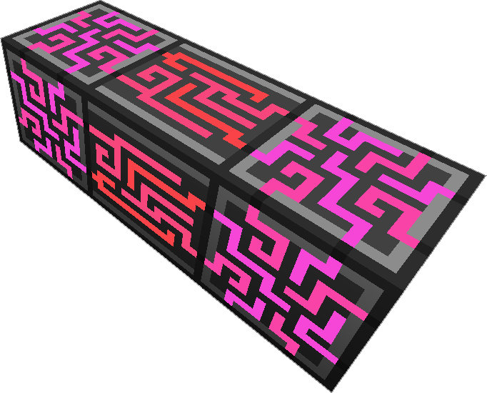

---
item_ids:
  - ae2:controller
navigation:
  title: ME Controller
---

The <ItemLink id="controller"/> is the routing hub of a [ME Network](../me-network.md).
Without it, only up to 8 devices can interact, any more and everything stops working.

It is not possible to have 2 <ItemLink id="controller" /> in one [ME Network](../me-network.md).

Unlike most [ME Network](../me-network.md) devices, the <ItemLink id="controller"/> does not require
[channels](channels.md), rather it emits them 8 or 32 per side, depending how many [channels](channels.md) the device supports.

The <ItemLink id="controller"/> requires 6 AE/t per controller block to
function. Each <ItemLink id="controller"/> block can store 8000 AE, so larger networks might require additional
energy storage. See [network energy](network-energy.md) for details.

Multiblock Controllers can be build in a fairly free form, however there are a few rules that must be followed:

1. All <ItemLink id="controller"/> blocks on a [ME Network](../me-network.md) must be connected; else the blocks will turn red.
2. The size of the <ItemLink id="controller"/> must be within 7x7x7; else it will turn red.
3. A <ItemLink id="controller"/> can have 2 adjacent blocks in at most 1 axis; if a block violates this rule, it will disable and turn white.

As long as all rules are followed and powered, the controller should glow and
cycle colors.

<RecipeFor id="controller" />
