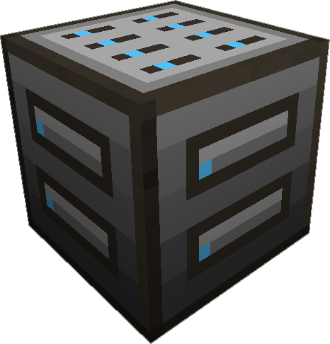

---
categories:
  - ME Network/Misc
item_ids:
  - ae2:io_port
related:
  - Possible Upgrades
navigation:
  title: ME IO Port
---

This block lets transfer items between your [ME Network](../../me-network.md) and your <ItemLink id="item_storage_cell_1k" /> or other storage cells,
unlike other forms of automation the <ItemLink id="io_port" /> can send items without any configuration of which items to send.

The top of the UI indicates which direction you wish to move the data, into the cell, or into the networks.

The <ItemLink id="io_port"/> requires a [channel](../channels.md) to function. When used with automation, the
input is the top or bottom, and the output is any of the sides.

If you're storing data onto cells it's usually a good idea to pre-format them,
that way you can get just the items you're interested in, and not get tons of
extra items.

<RecipeFor id="io_port" />
