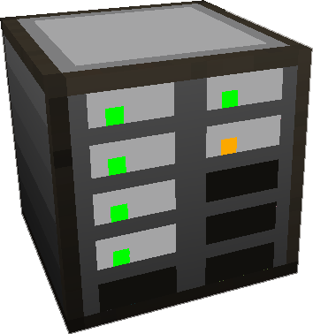

---
categories:
  - ME Network/Network Storage
item_ids:
  - ae2:drive
related:
  - Other Networked Storage
  - Storage Cells
navigation:
  title: ME Drive
---

A block designed to
do one thing, store Storage Cells. This block holds 10 storage cells so you
can tightly pack your storage into a very small space.

<ItemLink id="drive" />

show their contents and the storage cell status on the front of the drive
face.

- Red - Indicates the Storage Cell is Full.
- Orange - Indicates the Storage Cell cannot hold any more types, but it can store more items.
- Green - Indicates the cell can hold more types, or more items.
- Black - Indicates there is no channel, or power is offline.

Its important to note, that without a [ME Network](../../me-network.md)
this block does nothing. Its only useful when combined with a way to input,
and output items, and requires 2 AE/t power to function, and additional power
for each Storage Cell stored inside it.

The <ItemLink id="drive"/> requires a
[channel](../channels.md) to function.

<RecipeFor id="drive" />
