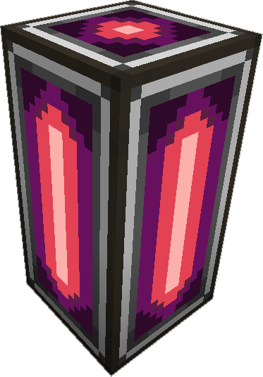

---
categories:
  - ME Network/Spatial
item_ids:
  - ae2:spatial_pylon
navigation:
  title: Spatial Pylon
---

The main
block used to construct a [Spatial Containment Structure](spatial-containment-structure.md),
they must be built in straight lines, with
a minium length of 2. When powered and on a network they will either glow a
light purple, or a light red, if the color is light red, that indicates design
has an issue and needs to be adjusted. They emitt a small amount of light when
powered.

Only useful when used in conjunction with a <ItemLink
id="spatial_io_port"/>, All <ItemLink
id="spatial_pylon"/> in an [ME Network](../../me-network.md) are part of the
same [SCS](spatial-containment-structure.md).

Each Spatial Pylon Multiblock requires a [channel](../channels.md) ( 1
per strand of blocks, not 1 per <ItemLink
id="spatial_pylon"/> ) to function.

<RecipeFor id="spatial_pylon" />
