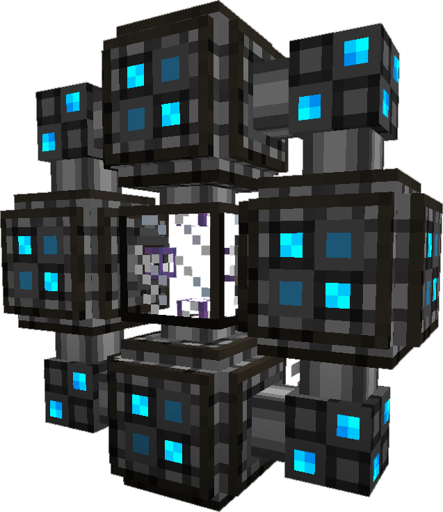

---
navigation:
  title: ME Quantum Network Bridge
---

# Quantum Network Bridge

A multiblock structure that connects 2 potentially distant network fragments
together. Created by crafting 8 <ItemLink
id="quantum_ring"/> and a <ItemLink
id="quantum_link"/> and placing the <ItemLink
id="quantum_link"/> in the center, and
sourrounding it in the 8 <ItemLink
id="quantum_ring"/>.

Each Quantum Network Bridge requires power to function. This
power must be provided from the network fragment it is attached to until the
bridge is linked; at which time power from either side will be available.
However if power is lost, connectivity will fail and power will be drained
from the side the bridge is on in attempt to restore connection.

When the Quantum Network Bridge is powered, the various blue lights on the structure will turn on and glow.
The Quantum Network Bridge requires 200 AE/t ( 100 EU/t, 400 RF/t )

To establish a link between 2 Quantum Network Bridges, you must
create a pair of <ItemLink
id="quantum_entangled_singularity"/>. One of
each will be placed inside of a particular connection. Each Bridge may only
connect to one other bridge.

You might consider renaming your <ItemLink
id="quantum_entangled_singularity"/> to better
identify the connection.

### Checklist

1. Are both sides of the Quantum Network Bridge powered? The lights turn on if they are.
2. Are the matching pair of <ItemLink id="quantum_entangled_singularity"/> in each bridge?
3. Are both sides chunk-loaded?
4. Make sure you only have 1 controller, the other side of the bridge is still the same network.
5. Power and network connectivty must connect to the 4 edges, not the corners.
