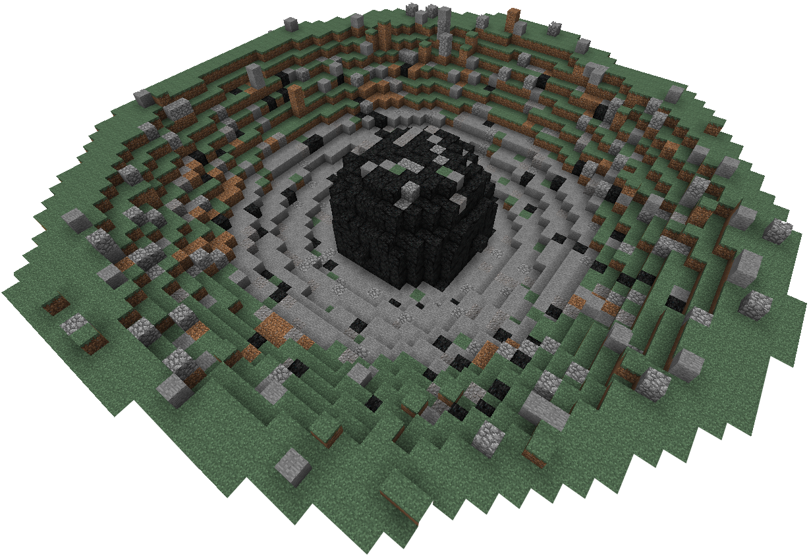
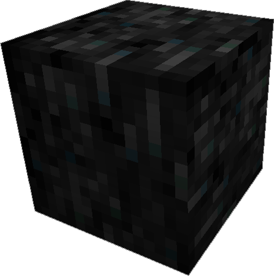

---
navigation:
  title: Meteorites
item_ids:
  - ae2:meteorite_compass
  - ae2:sky_stone_block
---

### Meteorites

Meteorites can be found on the surface or underground of the overworld, and vary in size.
They generally contain a <ItemLink id="sky_stone_chest"/> which can contain various
ingredients required for advanced technology. You can use a <ItemLink id="meteorite_compass"/> to
locate meteorites near you and as you explore.

Meteorites are the only natural source of sky stone.

### Meteorite Compass

A compass which points to the nearest <ItemLink id="sky_stone_block"/> in the current world, it
has a max range of roughly 2,700 blocks.

If it is spinning rapidly it means the current chunk your standing in contains
skystone. If its spinning slowly, it means that there is no meteorite in range,
this usually means you should do some more exploring, it will find one as new
terrain is generated, or in some cases such as the nether you can use skystone
blocks to control the compass since skystone doesn't spawn naturally.

To craft a meteorite compass, charge a normal compass in a <ItemLink id="charger" />.
This can be done very early by using a <ItemLink id="crank" />.

### Sky Stone

<ItemLink id="sky_stone_block" /> is a blast resistant dark stone block found in
meteorites that have impacted the surface in the distant or semi recent past. Their
origin is unknown however they appear to contain remnant of technology from another
place.

<ItemLink id="sky_stone_block" /> is extremely hard and requires at least a diamond
pick to mine it, the processed variants can be removed with any pick, however.
