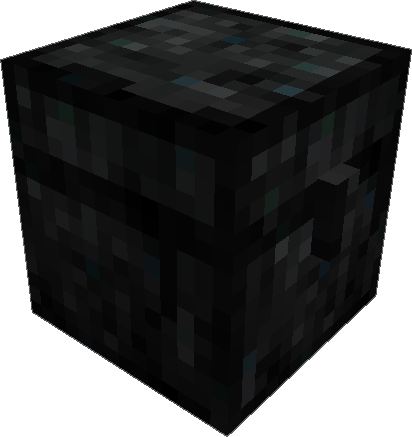
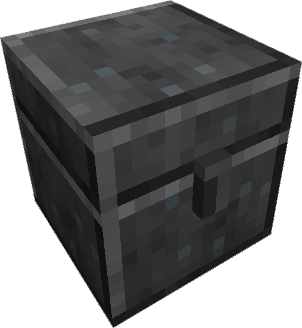

---
categories:
  - Simple Tools/Skystone Chests
  - World Gen
  - Decorative Blocks/Skystone Blocks
item_ids:
  - ae2:sky_stone_chest
  - ae2:smooth_sky_stone_chest
navigation:
  title: Sky Stone Chest
---

Chests can be crafted from <ItemLink id="sky_stone_block" /> found in meteorites.
They are blast resistant and hold up to 36 stacks of items.

<RecipeFor id="sky_stone_chest" />

<RecipeFor id="smooth_sky_stone_chest" />

