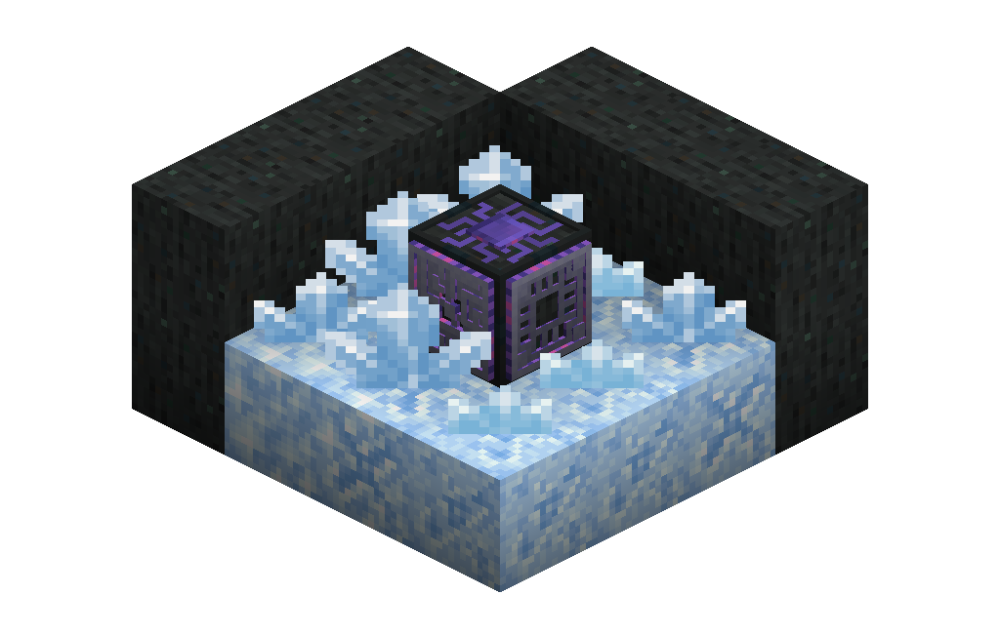
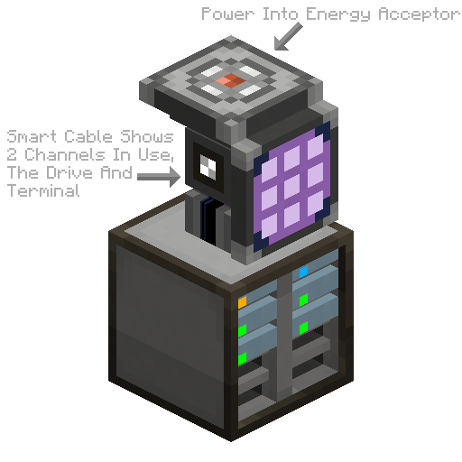

---
navigation:
  title: Getting Started (1.19+)
  position: 10
---

  The following information only applies to Applied Energistics 2 in Minecraft 1.19 and newer.

## Getting Started

## Getting The Initial Materials

To get started with Applied Energistics 2, one must first find a [meteorite](./features/meteorites.md). These are fairly common and tend to leave massive holes in the terrain, so you've probably encountered one in your travels.
If you haven't, you can craft a <ItemLink id="meteorite_compass" />, which will point toward the nearest NEED INFO DOES IT POINT AT THE SKY STONE OR THE MYSTERIOUS CUBE.

Once you have found a meteorite, mine into its center. You will find certus quartz clusters, certus quartz buds, budding certus quartz of various types, and a Mysterious Cube in the center.

Mine the certus quartz clusters and any certus quartz blocks you find. You can also pick up the budding certus blocks, but without silk touch they will drop as plain certus quartz blocks and even with silk touch they will degrade by one tier.

Do not break any flawless budding certus, as even with silk touch they will degrade to flawed budding certus, and it is impossible to repair them back to flawless.

Also mine the Mysterious Cube in the center of the meteorite to gain all 4 inscriber presses.

## Growing Quartz
Certus quartz buds will sprout from budding certus blocks, similar to amethyst. If you break a bud that is not finished growing, it will drop one certus quartz dust, unchanged by fortune. If you break a fully grown cluster, it will drop four certus quartz crystals, and fortune will increase this number.

Every time a bud grows by another stage, the budding block has a chance to degrade by one tier, eventually turning into a plain certus quartz block. They can be repaired (and new budding blocks created) by throwing the budding block (or a certus quartz block) in water with one or more charged certus.

By themselves, certus quartz buds grow very slowly. Luckily the <ItemLink id="quartz_growth_accelerator" /> massively accelerates this process when placed adjacent to the budding block. You should build a few of these as your first priority.

If you don't have enough quartz to also make an <ItemLink id="energy_acceptor" /> or <ItemLink id="vibration_chamber" />, you can make a <ItemLink id="crank" /> and stick it on the end of your accelerator.

Harvesting the certus automatically is "left as an exercise for the reader".

## A Quick Aside on Fluix
Another material you will need is Fluix, which you have already encountered in making growth accelerators. It is made by throwing charged certus, redstone, and nether quartz in water. Doing this automatically is "left as an exercise for the reader."

The <ItemLink id="charger" /> is required to produce charged quartz, if you haven't made one already.

## Inscribing Some Processors
In your looting of a meteorite, you will have found four "presses" from breaking the Mysterious Cube. These are used in the <ItemLink id="inscriber" /> to make the three types of processor.
  <ItemGrid>
  <ItemIcon id="silicon_press" />
  <ItemIcon id="logic_processor_press" />
  <ItemIcon id="calculation_processor_press" />
  <ItemIcon id="engineering_processor_press" />
  </ItemGrid>

The inscriber is a sided machine, much like the vanilla furnace. Inserting from the top or bottom places items in the top or bottom slots, and inserting from the side or back inserts into the center slot. Results can be pulled from the side or back.

To facilitate automation with hoppers (and possibly reduce pipe spaghetti), inscribers can be rotated with a <ItemLink id="certus_quartz_wrench" />.

Produce a few of each type of processor in preparation for the next step, making a very basic ME system. Automating processor production is "left as an exercise for the reader".

## Matter Energy Tech: ME Networks and Storage

### What is ME Storage?

Its pronounced Emm-Eee, and stands for Matter Energy.

Matter Energy is the main component of Applied Energistics 2, it's like a mad scientist version of a Multi-Block chest,
and it can revolutionize your storage situation. ME is extremely different then other storage systems in Minecraft, and
it might take a little out of the box thinking to get used to; but once you get started vast amounts of storage in tiny
space, and multiple access terminals are just the tip of the iceberg of what becomes possible.

### What do I need to know to get started?

First, ME Stores items inside of other items, called [Storage cells](./features/storage-cells.md); there are 5 tiers with ever increasing amounts of 
storage. In order to use a Storage Cell it must be placed inside either an <ItemLink id="chest"/>,
or an <ItemLink id="drive"/>.

The <ItemLink id="chest"/> shows you the contents of the Cell as soon as its placed inside, and you
can add and remove items from it as if it were a <ItemLink id="minecraft:chest"/>, with the exception that the items are
actually stored in the Storage cells, and not the <ItemLink id="chest"/> itself.

While the <ItemLink id="chest"/> is a great way to get introduced to the concept of ME, to really
take advantage you need to set up an [ME Network](features/me-network.md).

## Your Very First ME System
Now that you have all of the basic materials and machines for Applied Energistics 2, you can make your first ME (Matter Energy) system. This will be a very basic one, no autocrafting, no logistics, just nice, simple, searchable storage.

- Your ingredients list:
    - 1x <ItemLink id="drive" />
    - 1x <ItemLink id="terminal" /> or <ItemLink id="crafting_terminal" />
    - 1x <ItemLink id="energy_acceptor" />
    - A few [cables](./features/me-network/cables.md), either glass, covered, or smart, but not dense
    - A few [storage cells](./features/storage-cells.md), recommended of the 4k variety for a good mix of capacity and types (it would be more efficient to partition a mix of 4k and 1k but that's a complexity we won't go into now)
1. Place the drive down.
2. The energy acceptor (and several other AE2 devices) comes in 2 modes, cube and flat. They can be switched between in a crafting grid. If your energy acceptor is a cube, place it down next to the drive. If it's a flat square, place a cable on the drive and place the acceptor on that.
3. Run energy into the energy acceptor with a cable/pipe/conduit from your favorite energy-generation mod.
4. Place a cable on top of the drive (or otherwise at eye level) and place your terminal or crafting terminal on it.
5. Put your storage cells into the drive
6. Profit
7. Fiddle with the terminal's settings
8. Bask in your ultimate power and ability
9. Realize that this network is, in the grand scheme, rather small

### Expanding your Network

So you have some basic storage, and access to that storage, it's a good start, but you'll likely be looking to maybe
automate some processing.

A great example of this is to place a <ItemLink id="export_bus"/> on the top of a furnace to
dump in ores, and a <ItemLink id="import_bus"/>
on the bottom of the furance to extract furnaced ores.

The <ItemLink id="export_bus"/> lets you export items from the network, into the attached
inventory, while the <ItemLink id="import_bus"/> imports items from the attached inventory into
the network.

### Overcoming Limits

At this point you probably getting close to 8 or so devices, once you hit 9 devices you'll have to start
managing [channels](features/me-network/channels.md). Many devices but not all, require a [channel](features/me-network/channels.md) to
function. If the device deals solely with power, or connectivity like cables the device will not require
a [channel](features/me-network/channels.md). Anything that uses items, or moves them around, will.

By default network can support 8 [channels](features/me-network/channels.md), once you break this limit, you'll have to add
an <ItemLink id="controller"/> to your network. this allows you to expand your network greatly.

Each face of the controller will output 32 [channels](features/me-network/channels.md), depending on whats is accepting
these [channels](features/me-network/channels.md) will determine how they get used, for instance, if you place a <ItemLink id="
ae2:fluix_covered_dense_cable"/> next to the controller you will be able to carry a full 32
[channels](features/me-network/channels.md), however if you place a <ItemLink id="drive"/> next to it, or
non-dense cable, you will only get 8 [channels](features/me-network/channels.md). Smart cables will allow you to see how channels are routed through your network. Use them extensively when starting out to learn how channels act, or if you have a lot of redstone and glowstone.