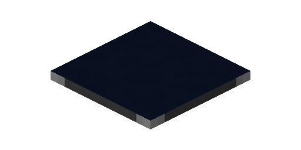
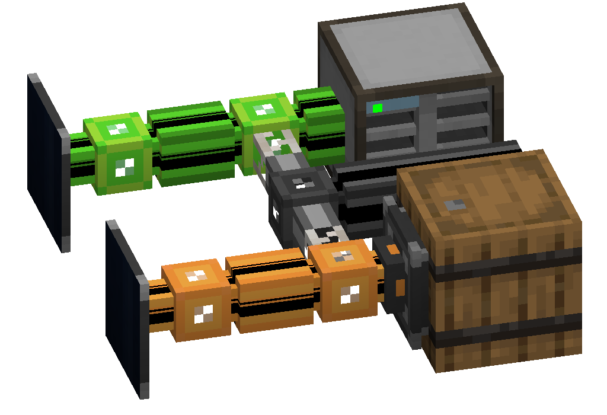

---
navigation:
  parent: items-blocks-machines/items-blocks-machines-index.md
  title: Annihilation Plane
  icon: annihilation_plane
item_ids:
- ae2:annihilation_plane
---
# The Annihilation Plane

The Annihilation Plane breaks blocks and picks up items. It works similarly to an <ItemLink id="import_bus" />, pushing things
into [network storage](../ae2-mechanics/import-export-storage.md). For items to be picked up, they must collide with the
face of the plane, it does not pick up in an area.

Annihilation planes can be enchanted with any pickaxe enchantment, so yes, you can put crazy levels of fortune on a few and
automate ore processing if your modpack allows it.

# Filtering

The annihilation plane will only break a block or pick up an item if it can store the resulting drops/items
in its network. this means to filter one, *you must restrict what can be stored on its network*, most likely by putting
it on a [subnetwork](../ae2-mechanics/subnetworks.md). A <ItemLink id="storage_bus" /> or cell can be partitioned to achieve this.

# Recipe

<RecipeFor id="annihilation_plane" />