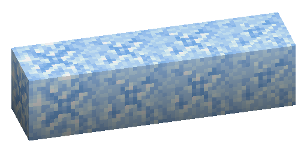

---
navigation:
  parent: items-blocks-machines/items-blocks-machines-index.md
  title: Budding Certus Quartz
  icon: flawless_budding_quartz
item_ids:
- ae2:flawless_budding_quartz
- ae2:flawed_budding_quartz
- ae2:chipped_budding_quartz
- ae2:damaged_budding_quartz
- ae2:small_quartz_bud
- ae2:medium_quartz_bud
- ae2:large_quartz_bud
- ae2:quartz_cluster
---
# Budding Certus Quartz
(also see [Farming Certus](../ae2-mechanics/farming-certus.md))

Certus quartz buds will sprout from budding certus blocks, similar to amethyst. These are found in [meteorites](../ae2-mechanics/meteorites.md)
There are 4 tiers of budding certus blocks: Flawless, Flawed, Chipped, and Damaged. They can be most easily identified
with a mod like HWYLA, Jade, The One Probe, etc. (or the f3 screen)

With flawed, chipped, and damaged budding certus, every time a bud grows by another stage, the budding block has a chance
to degrade by one tier, eventually turning into a plain <ItemLink id="quartz_block" />.

Flawless budding certus will not degrade from growing buds, and act as an infinite source.

If broken with a regular pickaxe, budding certus blocks will become certus quartz blocks. If broken with a pickaxe
enchanted with silk touch, they will instead degrade by 1 tier. **This means that flawless budding certus blocks cannot
be picked up and moved with a pickaxe**. Instead, [Spatial Storage](../ae2-mechanics/spatial-storage.md) can be used to
cut-and-paste the flawless budding blocks around.

# Recipe

Flawed, chipped, and damaged budding certus can be crafted by throwing the previous tier of budding block (or a <ItemLink id="quartz_block" />)
in water with one or more <ItemLink id="charged_certus_quartz_crystal" />.

Flawless budding certus cannot be crafted, only found in the world.

<RecipeFor id="damaged_budding_quartz" />
<RecipeFor id="chipped_budding_quartz" />
<RecipeFor id="flawed_budding_quartz" />

