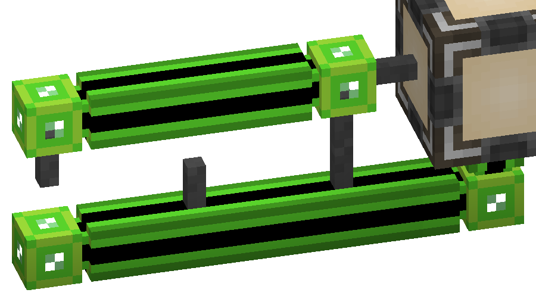

---
navigation:
  parent: items-blocks-machines/items-blocks-machines-index.md
  title: Cable Anchor
  icon: cable_anchor
item_ids:
- ae2:cable_anchor
---
# The Cable Anchor

Small decorative cable-mounted spikes that you can use to create ladders with cables, or make the cable appear
connected to the walls around it. Also used to craft <ItemLink id="facade"/>.

Cable anchors prevent connections from forming on the side they're mounted on.

# Recipe

<RecipeFor id="cable_anchor" />