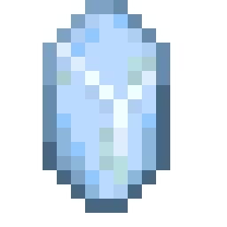

---
navigation:
  parent: items-blocks-machines/items-blocks-machines-index.md
  title: Certus Quartz Crystal
  icon: certus_quartz_crystal
item_ids:
- ae2:certus_quartz_crystal
---
# The Certus Quartz Crystal

<ItemImage id="certus_quartz_crystal" scale="1" />

*"Certus Quartz Crystals possess the unique trait of accepting large quantities of energy into their crystalline matrix"*

One of the primary ingredients for AE2 blocks, devices, and items. Made by growing it from [budding certus](../ae2-mechanics/farming-certus.md).

# Some Alternate Recipes

<Recipe id="misc/deconstruction_certus_quartz_block" />
<Recipe id="transform/certus_quartz_crystals" />