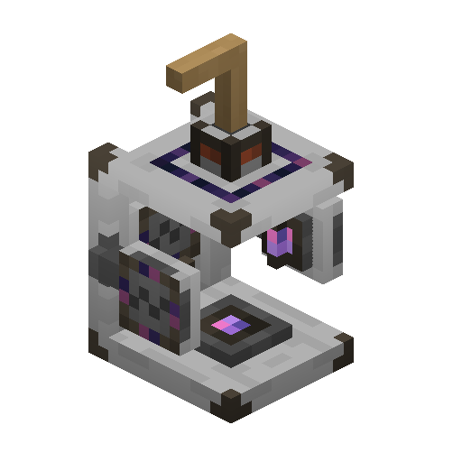
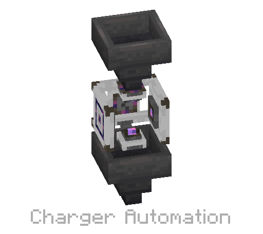

---
navigation:
  parent: items-blocks-machines/items-blocks-machines-index.md
  title: Charger
  icon: charger
item_ids:
- ae2:charger
---
# The Charger

The <ItemLink id="charger"/> provides a way to charge
supported tools through the [ME Network](../../me-network.md) or manually using a <ItemLink id="crank"/>.

Power can be provided via the top or bottom, via either AE2's [cables](cables.md), or other mod power cables. It can
accept either AE2's power (AE) or Forge Energy (FE). Items can be inserted or removed from any side. Only the results can
be removed, so no need for filters to prevent removing certus crystals instead of charged certus. Can be rotated with a 
<ItemLink id="certus_quartz_wrench" /> in order to facilitate automation.

Can be used to create <ItemLink id="charged_certus_quartz_crystal"/>
from <ItemLink id="certus_quartz_crystal"/>, and <ItemLink id="meteorite_compass" /> from <ItemLink id="minecraft:compass" />.

To power it manually, place a <ItemLink id="crank"/> on the top or bottom and right-click it until the item is charged.

It also acts as the workstation for the AE2 villager.

# Simple Automation

As an example, the rotateability lets you semi-automate chargers like so:

# Recipe

<RecipeFor id="charger" />