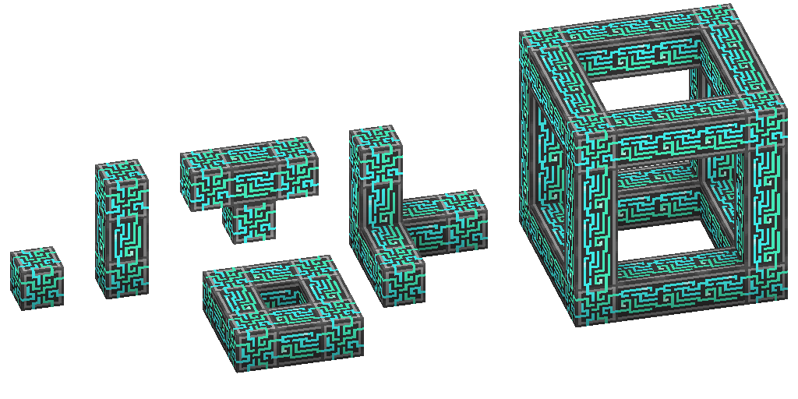
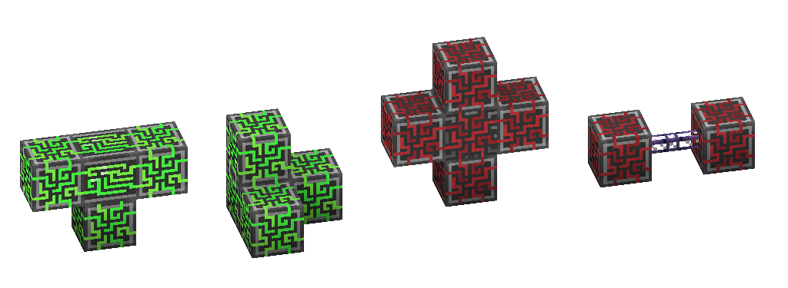

---
navigation:
  parent: items-blocks-machines/items-blocks-machines-index.md
  title: Controller
  icon: controller
item_ids:
- ae2:controller
---
# The Controller

The controller is the routing hub of a [ME Network](../me-network.md).
Without it, a network is "ad-hoc" and can only have a max of 8 channel-using devices total.

It is not possible to have 2 controllers in one [ME Network](../me-network.md).

The controller provides 32 [Channels](../ae2-mechanics/channels.md) per face.

The controller requires 6 AE/t per controller block to
function. Each controller block can store 8000 AE, so larger networks might require additional
energy storage. See [network energy](network-energy.md) for details.

Multiblock Controllers can be build in a fairly free form, however there are a few rules that must be followed:

1. All controller blocks on a [ME Network](../me-network.md) must be connected; else the blocks will turn red.
2. The size of the controller must be within 7x7x7; else it will turn red.
3. A controller can have 2 adjacent blocks in at most 1 axis; if a block violates this rule, it will disable and turn white.

As long as all rules are followed and powered, the controller should glow and
cycle colors.

You can right-click on a controller to get the same GUI as a <ItemLink id="network_tool"/>

# Recipe

<RecipeFor id="controller" />