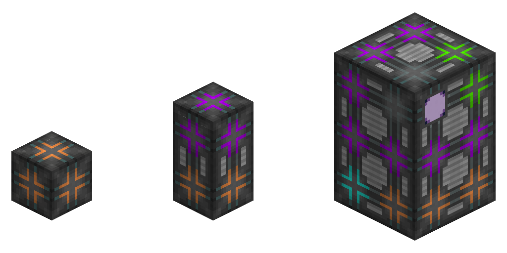

---
navigation:
  parent: items-blocks-machines/items-blocks-machines-index.md
  title: Crafting CPU Multiblock (Storage, Coprocessor, Monitor, Unit)
  icon: 1k_crafting_storage
  position: 210
item_ids:
- ae2:1k_crafting_storage
- ae2:4k_crafting_storage
- ae2:16k_crafting_storage
- ae2:64k_crafting_storage
- ae2:256k_crafting_storage
- ae2:crafting_accelerator
- ae2:crafting_monitor
- ae2:crafting_unit
---
# The Crafting CPU

<Row>
<BlockImage id="1k_crafting_storage" scale="4"  /><BlockImage id="crafting_accelerator" scale="4" />
<BlockImage id="crafting_monitor" scale="4" /><BlockImage id="crafting_unit" scale="4" />
</Row>

Crafting CPUs manage crafting requests/jobs. They store the intermediate ingredients while crafting jobs with multiple steps are
being carried out, and affect how big jobs can be, and to some degree how fast they are completed. See [autocrafting](../ae2-mechanics/autocrafting.md)
for more details.

# Settings

- The CPU can be set to accept requests from just players, just automation (like <ItemLink id="export_bus" />ses with
  <ItemLink id="crafting_card" />s), or both.

---

# Components

Crafting CPUs are multiblocks, and must be solid rectangular prisms with no gaps. They are made out of several components:

---

# Crafting Unit

<BlockImage id="crafting_unit" scale="4"  />

Crafting units simply fill space in a CPU in order to make it a solid rectangular prism, if you don't have enough
of the other components. They are also a base ingredient in the other components.

<RecipeFor id="crafting_unit" />

---

# Crafting Storage

<Row>
<BlockImage id="1k_crafting_storage" scale="4"  /><BlockImage id="4k_crafting_storage" scale="4"  /><BlockImage id="16k_crafting_storage" scale="4"  />
<BlockImage id="64k_crafting_storage" scale="4"  /><BlockImage id="256k_crafting_storage" scale="4"  />
</Row>

Crafting storages are available in all the standard cell sizes (1k, 4k, 16k, 64k, 256k). They store the ingredients and
intermediate ingredients involved in a craft, so larger or more storages are required for the CPU to handle crafting jobs
with more ingredients.

<Column>
<Row><RecipeFor id="1k_crafting_storage" /><RecipeFor id="4k_crafting_storage" /><RecipeFor id="16k_crafting_storage" /></Row>
<Row><RecipeFor id="64k_crafting_storage" /><RecipeFor id="256k_crafting_storage" /></Row>
</Column>

---

# Crafting Co-Processing Unit

<BlockImage id="crafting_accelerator" scale="4"  />

Crafting co-processors make the system send out ingredient batches from <ItemLink id="pattern_provider" />s more often.
This allows them to keep up with machines that process quickly. An example of this is a pattern provider surrounded by
<ItemLink id="molecular_assembler" />s being able to push ingredients faster than a single assembler can process, and thus
distributing the ingredient batches between the surrounding assemblers.

<RecipeFor id="crafting_accelerator" />

---

# Crafting Monitor

<BlockImage id="crafting_monitor" scale="4"  />

The crafting monitor displays the job the CPU is handling at the moment.
The screen can be colored with a <ItemLink id="color_applicator" />.

<RecipeFor id="crafting_monitor" />

