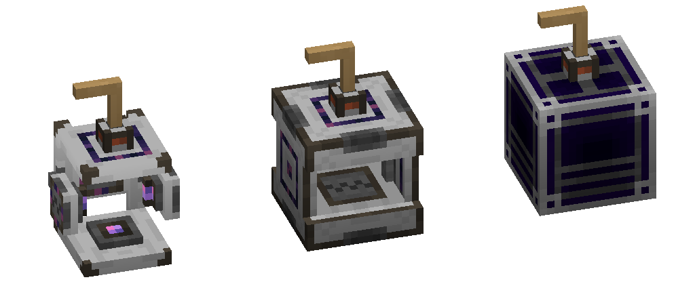

---
navigation:
  parent: items-blocks-machines/items-blocks-machines-index.md
  title: Crank
  icon: crank
item_ids:
- ae2:crank
---
# The Crank

The crank is used to power other machines when you don't otherwise have access to power (or an <ItemLink id="energy_acceptor" />). Early-game struggles, am I right?

# Recipe

<RecipeFor id="crank" />