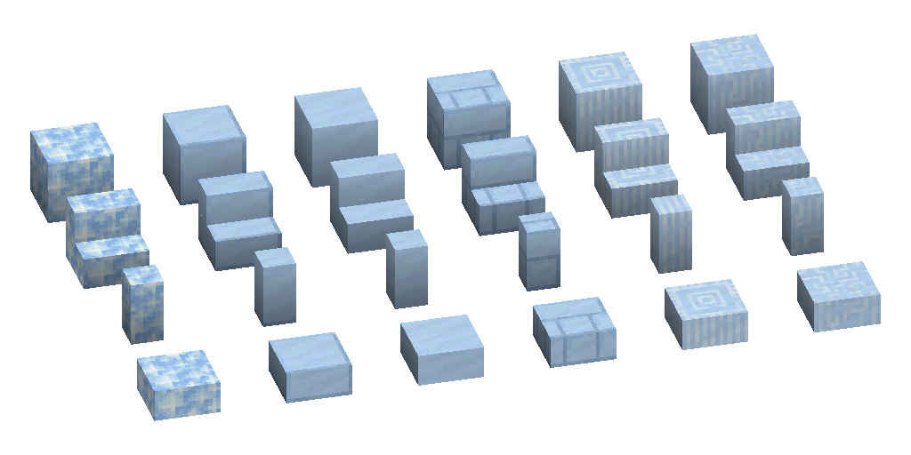

---
navigation:
  parent: items-blocks-machines/items-blocks-machines-index.md
  title: Decorative Certus Blocks
  icon: quartz_pillar
item_ids:
- ae2:cut_quartz_block
- ae2:smooth_quartz_block
- ae2:quartz_bricks
- ae2:quartz_pillar
- ae2:chiseled_quartz_block
- ae2:quartz_stairs
- ae2:cut_quartz_stairs
- ae2:smooth_quartz_stairs
- ae2:quartz_brick_stairs
- ae2:quartz_pillar_stairs
- ae2:chiseled_quartz_stairs
- ae2:quartz_wall
- ae2:cut_quartz_wall
- ae2:_smooth_quartz_wall
- ae2:quartz_brick_wall
- ae2:quartz_pillar_wall
- ae2:chiseled_quartz_wall
- ae2:quartz_slab
- ae2:cut_quartz_slab
- ae2:smooth_quartz_slab
- ae2:quartz_brick_slab
- ae2:quartz_pillar_slab
- ae2:chiseled_quartz_slab
---
# Decorative Certus Blocks

<ItemLink id="quartz_block" />s can be crafted, smelted, and stonecut into some decorative building blocks

# Recipes

<RecipeFor id="cut_quartz_block" /> <RecipeFor id="smooth_quartz_block" /> <RecipeFor id="quartz_bricks" /> <RecipeFor id="quartz_pillar" /> <RecipeFor id="chiseled_quartz_block" />

<RecipeFor id="quartz_stairs" /> <RecipeFor id="cut_quartz_stairs" /> <RecipeFor id="smooth_quartz_stairs" /> <RecipeFor id="quartz_brick_stairs" /> <RecipeFor id="quartz_pillar_stairs" /> <RecipeFor id="chiseled_quartz_stairs" />

<RecipeFor id="quartz_wall" /> <RecipeFor id="cut_quartz_wall" /> <RecipeFor id="smooth_quartz_wall" /> <RecipeFor id="quartz_brick_wall" /> <RecipeFor id="quartz_pillar_wall" /> <RecipeFor id="chiseled_quartz_wall" />

<RecipeFor id="quartz_slab" /> <RecipeFor id="cut_quartz_slab" /> <RecipeFor id="smooth_quartz_slab" /> <RecipeFor id="quartz_brick_slab" /> <RecipeFor id="quartz_pillar_slab" /> <RecipeFor id="chiseled_quartz_slab" />