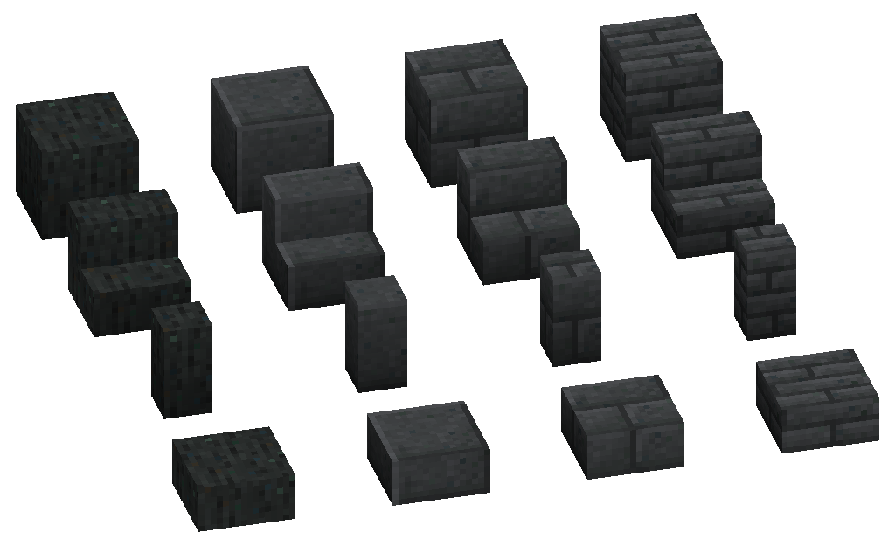
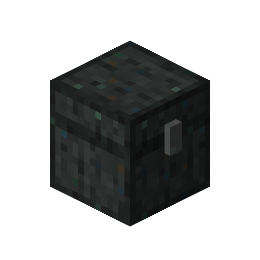
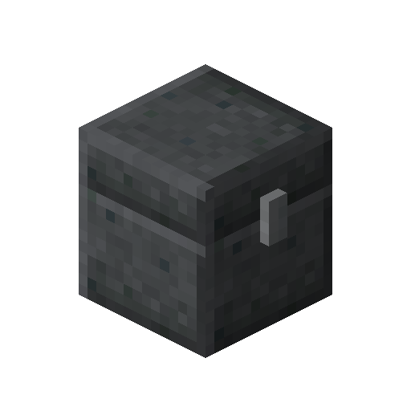

---
navigation:
  parent: items-blocks-machines/items-blocks-machines-index.md
  title: Decorative Sky Stone
  icon: sky_stone_stairs
item_ids:
- ae2:sky_stone_brick
- ae2:sky_stone_small_brick
- ae2:sky_stone_stairs
- ae2:smooth_sky_stone_stairs
- ae2:sky_stone_brick_stairs
- ae2:sky_stone_small_brick_stairs
- ae2:sky_stone_wall
- ae2:smooth_sky_stone_wall
- ae2:sky_stone_brick_wall
- ae2:sky_stone_small_brick_wall
- ae2:sky_stone_slab
- ae2:smooth_sky_stone_slab
- ae2:sky_stone_brick_slab
- ae2:sky_stone_small_brick_slab
---
# Decorative Sky Stone

  

<ItemLink id="sky_stone_block" /> blocks can be crafted and stonecut into some decorative building blocks

# Recipes

<RecipeFor id="sky_stone_chest" /> <RecipeFor id="smooth_sky_stone_chest" />
<RecipeFor id="sky_stone_brick" /> <RecipeFor id="sky_stone_small_brick" />
<RecipeFor id="sky_stone_stairs" /> <RecipeFor id="smooth_sky_stone_stairs" /> <RecipeFor id="sky_stone_brick_stairs" /> <RecipeFor id="sky_stone_small_brick_stairs" />
<RecipeFor id="sky_stone_wall" /> <RecipeFor id="smooth_sky_stone_wall" /> <RecipeFor id="sky_stone_brick_wall" /> <RecipeFor id="sky_stone_small_brick_wall" />
<RecipeFor id="sky_stone_slab" /> <RecipeFor id="smooth_sky_stone_slab" /> <RecipeFor id="sky_stone_brick_slab" /> <RecipeFor id="sky_stone_small_brick_slab" />