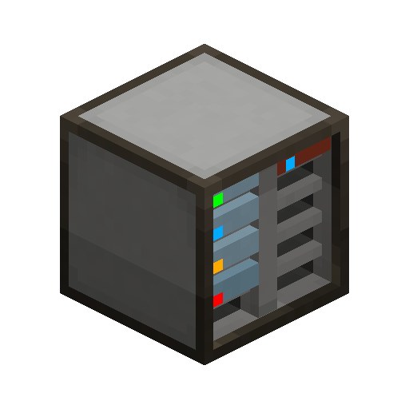

---
navigation:
  parent: items-blocks-machines/items-blocks-machines-index.md
  title: ME Drive
  icon: drive
  position: 210
item_ids:
- ae2:drive
---
# The ME Drive

The Drive is the [device](../ae2-mechanics/devices.md) you plug your [storage cells](storage_cells.md) into in order to use them for
[network storage](../ae2-mechanics/import-export-storage.md). It has 10 slots which each accept a cell.

If for some reason you want to, you can push and pull the cells from its inventory with any item logistics like hoppers or ae2 busses.

It can be rotated with a <ItemLink id="certus_quartz_wrench" />.

# Cell Status LEDs

The cells in the drive have an LED on them which shows their status:

| Color  | Status                                                                           |
|:-------|:---------------------------------------------------------------------------------|
| Green  | Empty                                                                            |
| Blue   | Has some contents                                                                |
| Orange | [Types](../ae2-mechanics/bytes-and-types.md) full, no new types can be added     |
| Red    | [Bytes](../ae2-mechanics/bytes-and-types.md) full, no more items can be inserted |
| Black  | No power or drive has no [channel](../ae2-mechanics/channels.md)                 |

- Green  - Empty
- Blue   - Has some contents
- Orange - [Types](../ae2-mechanics/bytes-and-types.md) full, no new types can be added
- Red    - [Bytes](../ae2-mechanics/bytes-and-types.md) full, no more items can be inserted
- Black  - No power or drive has no [channel](../ae2-mechanics/channels.md)

# Priority

Priorities can be set by clicking the wrench in the top-right of the GUI.
Items entering the network will start at the highest priority storage as
their first destination. In the case of two storages or cells have the same priority,
if one already contains the item, they will prefer that storage over any
other. Any [partitioned](cell_workbench.md) cells will be treated as already containing the item
when in the same priority group as other storages. Items being removed from storage will
be removed from the storage with the lowest priority. This priority system means as items are inserted and removed
from network storage, higher priority storages will be filled and lower priority storages will be emptied.

# Recipe

<RecipeFor id="drive" />