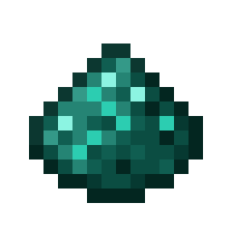

---
navigation:
  parent: items-blocks-machines/items-blocks-machines-index.md
  title: Ender Dust
  icon: ender_dust
item_ids:
- ae2:ender_dust
---
# Ender Dust

An ender pearl that has been crushed by an <ItemLink id="inscriber"/>. Used in the production of <ItemLink id="wireless_booster"/>s
and <ItemLink id="quantum_entangled_singularity"/> pairs.

# Recipe

<RecipeFor id="ender_dust" />