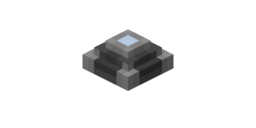

---
navigation:
  parent: items-blocks-machines/items-blocks-machines-index.md
  title: Export Bus
  icon: export_bus
item_ids:
- ae2:export_bus
---
# The Export Bus

The export bus pulls items and fluids (and whatever else, given addons) from [network storage](../ae2-mechanics/import-export-storage.md)
and pushes them into  the inventory it's touching.

They are [cable subparts](../ae2-mechanics/cable-subparts.md)

# Filtering

By default the bus will not export anything. Items inserted into its filter slots will act as a whitelist,
allowing those specific items to be exported.

Items can be dragged into the slots from JEI/REI even if you don't actually have any of that item.

# Upgrades

The import bus supports the following upgrades:

- <ItemLink id="capacity_card" /> increases the amount of filter slots
- <ItemLink id="speed_card" /> increases the amount of stuff moved per operation
- <ItemLink id="fuzzy_card" /> lets the bus filter by damage level
- <ItemLink id="crafting_card" /> lets the bus send crafting requests to your [autocrafting](../ae2-mechanics/autocrafting.md)
  system to get the items it desires. Can be set to pull the items from storage if possible, or to always make a request
  for a new item to be crafted.
- <ItemLink id="redstone_card" /> adds redstone control, allowing active on high signal, low signal, or once per pulse

# Recipe

<RecipeFor id="import_bus" />