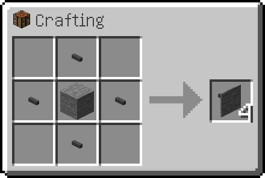

---
navigation:
  parent: items-blocks-machines/items-blocks-machines-index.md
  title: Facades
  icon: facade
  position: 110
item_ids:
- ae2:facade
---
# Facades

Facades can be used to make your base appear more clean. They can cover up both sizes of cable, and be made out of many
kinds of blocks.

They can cover all sides of a cable, but will let [subparts](../ae2-mechanics/cable-subparts.md) and cable connections
protrude though.

Be clever with them to improve your base aesthetic or make blocks with different textures on each side.

# Recipe

Place the block you want the texture of in the middle of 4 <ItemLink id="cable_anchor"/>s.

