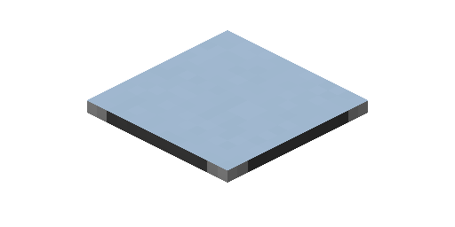

---
navigation:
  parent: items-blocks-machines/items-blocks-machines-index.md
  title: Formation Plane
  icon: formation_plane
item_ids:
- ae2:formation_plane
---
# The Formation Plane

The Formation Plane places blocks and drops items. It works similarly to an insert-only <ItemLink id="storage_bus" />,
placing/dropping when things are "stored" in it by devices inserting into [network storage](../ae2-mechanics/import-export-storage.md).

This device makes use of the mechanics used by storage busses in things like [pipe subnets](../example_setups/pipe-subnet.md),
and can replace storage busses in those setups if you want to drop items/place blocks instead of transport items.

They are [cable subparts](../ae2-mechanics/cable-subparts.md)

# A bug that might have been fixed

There may or may not be a bug where the button to swap between placing blocks and dropping items does not show up
until you set something in the formation plane's filter. After you toggle the button to what you want you can remove the item
from the filter.

# Filtering

By default the plane will place/drop anything. Items inserted into its filter slots will act as a whitelist, only
allowing those specific items to be placed.

Items can be dragged into the slots from JEI/REI even if you don't actually have any of that item.

# Priority

Priorities can be set by clicking the wrench in the top-right of the GUI.
Items entering the network will start at the highest priority storage.

# Settings

- The plane can be set to place blocks in-world or drop items

# Upgrades

The formation plane supports the following upgrades:

- <ItemLink id="capacity_card" /> increases the amount of filter slots
- <ItemLink id="fuzzy_card" /> lets the plane filter by damage level
- <ItemLink id="inverter_card" /> switches the filter from a whitelist to a blacklist

# Recipe

<RecipeFor id="formation_plane" />