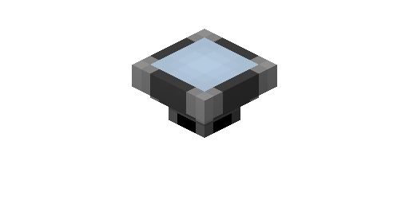

---
navigation:
  parent: items-blocks-machines/items-blocks-machines-index.md
  title: Import Bus
  icon: import_bus
item_ids:
- ae2:import_bus
---
# The Import Bus

The import bus pulls items and fluids (and whatever else, given addons) from the inventory it's touching and pushes them into
[network storage](../ae2-mechanics/import-export-storage.md).

They are [cable subparts](../ae2-mechanics/cable-subparts.md)

# Filtering

By default the bus will import anything it has access to. Items inserted into its filter slots will act as a whitelist, only
allowing those specific items to be imported.

Items can be dragged into the slots from JEI/REI even if you don't actually have any of that item.

# Upgrades

The import bus supports the following upgrades:

- <ItemLink id="capacity_card" /> increases the amount of filter slots
- <ItemLink id="speed_card" /> increases the amount of stuff moved per operation
- <ItemLink id="fuzzy_card" /> lets the bus filter by damage level and/or ignore item NBT
- <ItemLink id="inverter_card" /> switches the filter from a whitelist to a blacklist
- <ItemLink id="redstone_card" /> adds redstone control, allowing active on high signal, low signal, or once per pulse

# Recipe

<RecipeFor id="import_bus" />