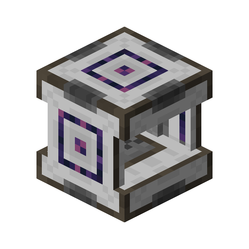

---
navigation:
  parent: items-blocks-machines/items-blocks-machines-index.md
  title: Inscriber
  icon: inscriber
item_ids:
- ae2:inscriber
---
## The Inscriber

The inscriber is used to inscribe circuits and processors using presses, and to crush various items into dust. It is sided, so
inserting items from different sides inserts them into different slots in its inventory. To facilitate this, it can be
rotated with a <ItemLink id="certus_quartz_wrench" />.

The 4 circuit presses are used to craft processors
  <ItemGrid>
  <ItemIcon id="silicon_press" />
  <ItemIcon id="logic_processor_press" />
  <ItemIcon id="calculation_processor_press" />
  <ItemIcon id="engineering_processor_press" />
  </ItemGrid>
While the name press can be used to name blocks similar to an anvil, useful for labeling things in a <ItemLink id="pattern_access_terminal" />.
  <ItemGrid>
  <ItemIcon id="name_press" />
  </ItemGrid>

### Recipe

<RecipeFor id="inscriber" />

### The GUI

A. **Top Input** accessed via the top side of the inscriber (items can be both pushed to and pulled from this slot)

B. **Center Input** inserted to via the left, right, front, and rear sides of the inscriber (items can only be pushed to this slot, not pulled from)

C. **Bottom Input** accessed via the bottom side of the inscriber (items can be both pushed to and pulled from this slot)

D. **Output** pulled from via the left, right, front, and rear sides of the inscriber (items can only be pulled from this slot, not pushed to)

### Upgrades

The inscriber supports the following upgrades:

- <ItemLink id="speed_card" />
