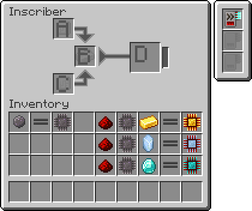

---
navigation:
  parent: items-blocks-machines/items-blocks-machines-index.md
  title: Inscriber
  icon: inscriber
  position: 310
categories:
- machines
item_ids:
- ae2:inscriber
---

# The Inscriber

<BlockImage id="inscriber" scale="8" />

The inscriber is used to inscribe circuits and [processors](processors.md) using [presses](presses.md), and to crush various items into dust.
It can accept either AE2's power (AE) or Fabric/Forge Energy (E/FE). It can be sided, such that inserting items from different sides
inserts them into different slots in its inventory. To facilitate this, it can be rotated with a <ItemLink id="certus_quartz_wrench" />.
It can also be set to push the results of crafts to adjacent inventories.

The size of the input buffer can be adjusted. For example, if you want to feed from one inventory into a big array of inscribers,
you want a small buffer so that the materials are distributed between the inscribers more optimally (instead of the first
inscriber filling up to 64 and the rest being empty).

The 4 circuit presses are used to craft [processors](processors.md)

<Row>
  <ItemImage id="silicon_press" scale="4" />

  <ItemImage id="logic_processor_press" scale="4" />

  <ItemImage id="calculation_processor_press" scale="4" />

  <ItemImage id="engineering_processor_press" scale="4" />
</Row>

While the name press can be used to name blocks similar to an anvil, useful for labeling things in a <ItemLink id="pattern_access_terminal" />.

<ItemImage id="name_press" scale="4" />

## Settings

* The inscriber can be set to be sided (as explained below) or allow inputs to any slot from any side, with an internal filter deciding
    what goes where. While in non-sided mode, items cannot be extracted from the top and bottom slots.
* The inscriber can be set to push items into adjacent inventories.
* The size of the input buffer can be adjusted, the large option is for a standalone inscriber you feed manually, the
small option is to make large parallelized setups more viable.

## The GUI And Sidedness

When in sided mode, the inscriber filters what goes where by which side you insert or extract from.

 

A. **Top Input** accessed via the top side of the inscriber (items can be both pushed to and pulled from this slot)

B. **Center Input** inserted to via the left, right, front, and rear sides of the inscriber (items can only be pushed to this slot, not pulled from)

C. **Bottom Input** accessed via the bottom side of the inscriber (items can be both pushed to and pulled from this slot)

D. **Output** pulled from via the left, right, front, and rear sides of the inscriber (items can only be pulled from this slot, not pushed to)

## Simple Automation

As an example, the sidedness and rotateability mean you can semi-automate inscribers like so:

<GameScene zoom="4" background="transparent">
  <ImportStructure src="../assets/assemblies/inscriber_hopper_automation.snbt" />
  <IsometricCamera yaw="195" pitch="30" />
</GameScene>

Or just pipe into and out of the inscriber when in non-sided mode.

## Upgrades

The inscriber supports the following [upgrades](upgrade_cards.md):

*   <ItemLink id="speed_card" />

## Recipe

<RecipeFor id="inscriber" />
