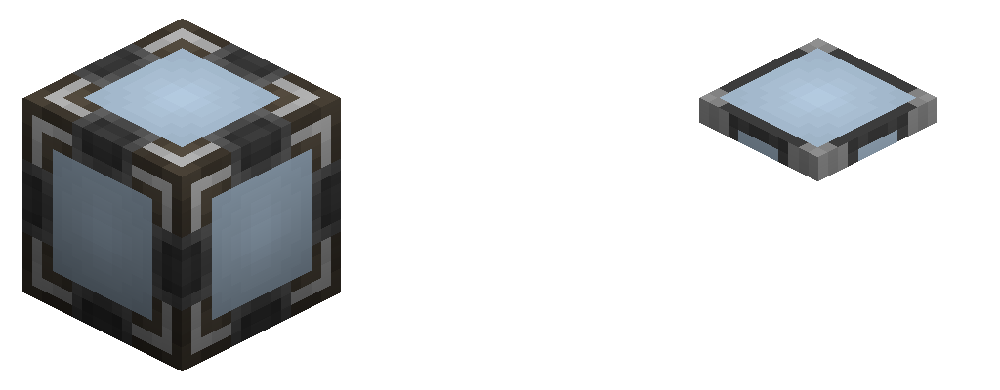
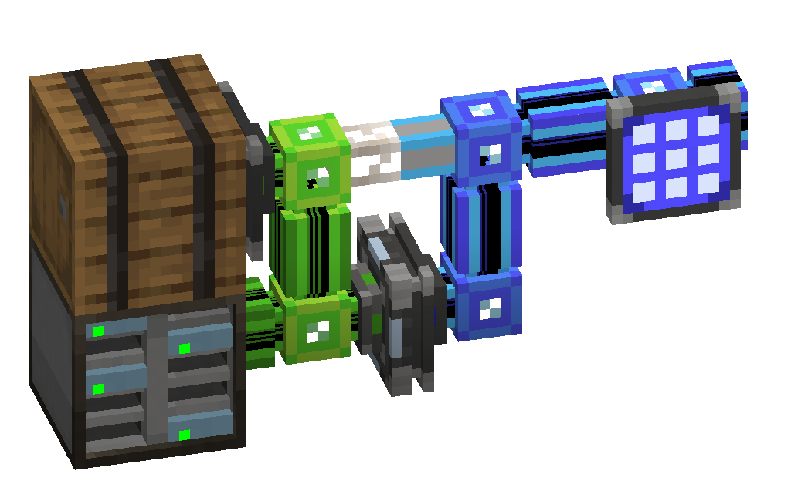

---
navigation:
  parent: items-blocks-machines/items-blocks-machines-index.md
  title: Interface
  icon: interface
item_ids:
- ae2:interface
- ae2:cable_interface
---
# The Interface

Interfaces act like a small chest that fills itself from and empties to [network storage](../ae2-mechanics/import-export-storage.md)
depending on what you set it to keep a stock of in its slots. It tries to complete this in a single gametick, so it can fill itself with
or empty itself from up to 9 stacks per gametick, making it a fast method of import or export if you have fast item pipes.

Interfaces also have a few special functionalities with other AE2 devices:

A <ItemLink id="storage_bus" /> on an unconfigured interface will present the entirety of the [network storage](../ae2-mechanics/import-export-storage.md)
of its network to the storage bus' network, as if the interface's network was one big chest the storage bus was placed on.

Pattern providers have a special interaction with interfaces on [subnets](../ae2-mechanics/subnetworks.md): if the interface is unconfigured
the provider will skip the interface entirely and push directly to that subnet's [storage](../ae2-mechanics/import-export-storage.md),
skipping the interface and not filling it with recipe batches, and more importantly, not inserting the next batch until there's space in storage.

# Variants

Interfaces come in 2 different variants: normal and flat. This affects which specific sides their inventories can be accessed
from and that they provide a network connection to.

- Normal interfaces allow things to push to, pull from, and access their inventory from all sides and, like most AE2 machines, act
  like a cable providing network connection to all sides.

- Flat interfaces are [cable subparts](../ae2-mechanics/cable-subparts.md), and so multiple can be placed on the same cable, allowing for compact setups.
  They allow things to push to, pull from, and access their inventory from their face but do not provide a network connection on their face.

Interfaces can be swapped between normal and flat in a crafting grid.

# Settings

The upper slots in the interface determine what the interface is set to stock inside itself. When something is placed in 
them or dragged from JEI/REI, a wrench appears that lets you set the quantity.

# Upgrades

The interface supports the following upgrades:

- <ItemLink id="fuzzy_card" /> lets the bus filter by damage level and/or ignore item NBT
- <ItemLink id="crafting_card" /> lets the interface send crafting requests to your [autocrafting](../ae2-mechanics/autocrafting.md)
  system to get the items it desires. It will pull the items from storage if possible, before maing a request
  for a new item to be crafted.

# Priority

Priorities can be set by clicking the wrench in the top-right of the GUI. Interfaces with higher priority will get their items
before those with lower priority, 

# Recipe

<Recipe id="network/blocks/interfaces_interface" />
<RecipeFor id="cable_interface" />