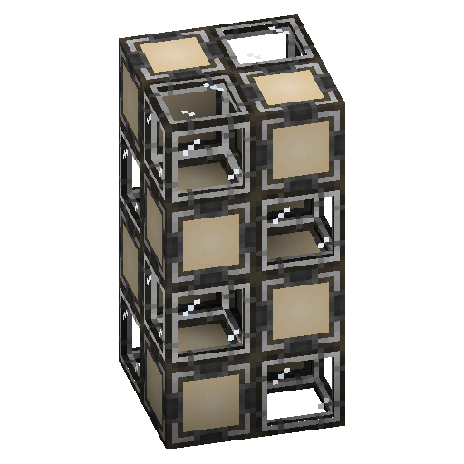

---
navigation:
  parent: items-blocks-machines/items-blocks-machines-index.md
  title: Molecular Assembler
  icon: molecular_assembler
item_ids:
- ae2:molecular_assembler
---
# The Molecular Assembler

The molecular assembler takes items input into it and carries out the operation defined by the inserted <ItemLink id="crafting_pattern" />,
<ItemLink id="smithing_table_pattern" />, or <ItemLink id="stonecutting_pattern" />, then pushes the result to adjacent inventories.

However, their main use is next to a <ItemLink id="pattern_provider" />. Pattern providers have special behavior in this case,
and will send the relevant pattern along with the ingredients to adjacent assemblers. Since assemblers auto-eject the results of
crafts to adjacent inventories (and thus into the return slots of the pattern provider), an assembler on a pattern provider 
is all that is needed to automate crafting patterns.

