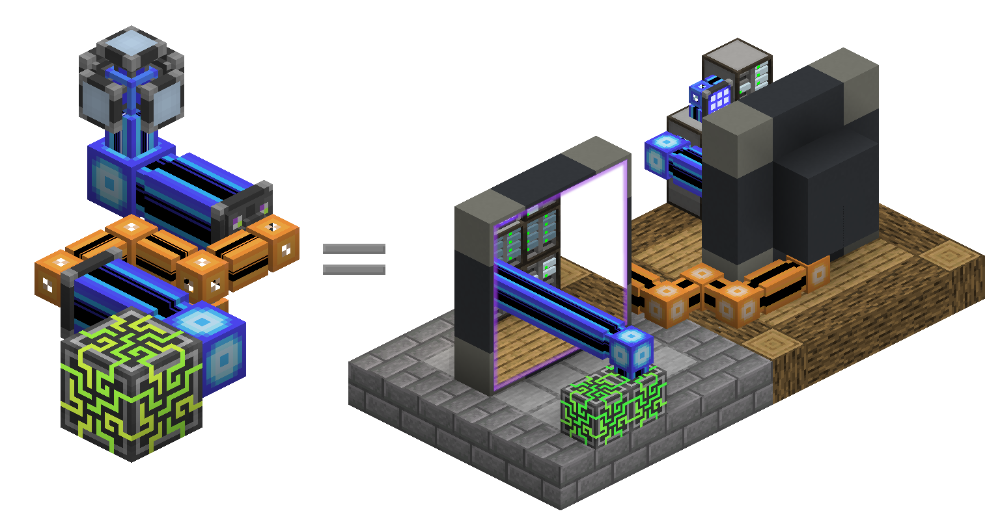

---
navigation:
  parent: items-blocks-machines/items-blocks-machines-index.md
  title: P2P Tunnels
  icon: me_p2p_tunnel
  position: 210
categories:
- devices
item_ids:
- ae2:me_p2p_tunnel
- ae2:redstone_p2p_tunnel
- ae2:item_p2p_tunnel
- ae2:fluid_p2p_tunnel
- ae2:fe_p2p_tunnel
- ae2:light_p2p_tunnel
---

# Point To Point Tunnels

<GameScene zoom="6" background="transparent">
  <ImportStructure src="../assets/assemblies/p2p_tunnels.snbt" />
  <IsometricCamera yaw="195" pitch="30" />
</GameScene>

P2P tunnels are a way to move things like items, fluids, redstone signals, power, light, and [channels](../ae2-mechanics/channels.md)
around a network without them directly interacting with the network. There are many variants of P2P tunnel but each
only transports its specific type of thing. They essentially act like portals that directly connect
two block faces at range. They are not bi-directional, there are defined inputs and outputs.

For example, the hopper facing the Item P2P will act as if it is directly connected to the barrel, and items will flow.

<GameScene zoom="4" background="transparent">
  <ImportStructure src="../assets/assemblies/p2p_hopper_barrel.snbt" />
  <IsometricCamera yaw="195" pitch="30" />
</GameScene>

However, two barrels next to each other will not transfer items between each other.

<GameScene zoom="4" background="transparent">
  <ImportStructure src="../assets/assemblies/p2p_barrel_barrel.snbt" />
  <IsometricCamera yaw="195" pitch="30" />
</GameScene>

There are also other variants like Redstone P2P.

<GameScene zoom="4" background="transparent">
  <ImportStructure src="../assets/assemblies/p2p_redstone.snbt" />
  <IsometricCamera yaw="195" pitch="30" />
</GameScene>

## Types Of P2P Tunnel And Attunement

<GameScene zoom="6" background="transparent">
  <ImportStructure src="../assets/assemblies/p2p_tunnels.snbt" />
  <IsometricCamera yaw="180" pitch="90" />
</GameScene>

There are many types of P2P tunnel. Only the ME P2P tunnel is directly craftable, the others are made by right-clicking other
P2P tunnels with certain items:
- ME P2P tunnels are selected by right-clicking with any [cable](../items-blocks-machines/cables.md).
- Redstone P2P tunnels are selected by right-clicking with a variety of redstone components.
- Item P2P tunnels are selected by right-clicking with a chest or hopper.
- Fluid P2P tunnels are selected by right-clicking with a bucket or bottle.
- Energy P2P tunnels are selected by right-clicking with almost any energy-containing item.
- Light P2P tunnels are selected by right-clicking with a torch or glowstone

Some tunnel types have quirks. For instance, ME P2P tunnels' channels cannot pass through other ME P2P tunnels, and
Energy P2P tunnels indirectly extract a 5% tax on FE or E flowing through themselves by increasing their
[energy](../ae2-mechanics/energy.md) draw.

## The Most-Used Form of P2P

The most common use case of P2P tunnels is using a ME P2P tunnel to compact the density of [channel](../ae2-mechanics/channels.md) transport.
Instead of a bundle of dense cable, a single dense cable can be used to carry many channels around.

In this example, 8 ME P2P inputs take 256 channels (8*32) from the main network's <ItemLink id="controller" /> and 8 ME P2P outputs 
output them somewhere else. Observe how each P2P tunnel input or output takes 1 channel. We can thus run many channels 
through a thin cable. And since our P2P tunnels are on a dedicated [subnetwork](../ae2-mechanics/subnetworks.md), we're not
even using up any channels from the main network to do this! Also observe how while the P2P tunnels can be placed directly
against a controller, a [dense smart cable](../items-blocks-machines/cables.md#smart-cable) can be placed in between to more easily visualize the channels.

<GameScene zoom="4" interactive={true}>
  <ImportStructure src="../assets/assemblies/p2p_compact_channels.snbt" />

  <BoxAnnotation color="#dddddd" min="1.3 1.3 6.3" max="2 2.7 6.7">
        Quartz Fiber shares energy between main network and p2p subnetwork.
  </BoxAnnotation>

  <IsometricCamera yaw="225" pitch="30" />
</GameScene>

For another example (including its use with [Quantum Bridges](quantum_bridge.md)) see this MS Paint diagram I can't be bothered
to touch up:

## Nesting

However, you cannot use this to send infinite channels through a single cable. The channel for a ME P2P tunnel will not
pass through another ME P2P tunnel, so you cannot recursively nest them. Observe how the outer layer of ME P2P tunnels
on the red cables are offline. Note that this only applies to ME P2P tunnels, other P2P tunnel types can pass through a ME P2P tunnel,
as seen by the Redstone P2P tunnels working fine.

<GameScene zoom="4" background="transparent">
  <ImportStructure src="../assets/assemblies/p2p_nesting.snbt" />
  <IsometricCamera yaw="225" pitch="30" />
</GameScene>

## Linking

<GameScene zoom="6" background="transparent">
  <ImportStructure src="../assets/assemblies/p2p_linking_frequency.snbt" />
  <IsometricCamera yaw="195" pitch="30" />
</GameScene>

The ends of a P2P tunnel connection can be linked using a <ItemLink id="memory_card" />. The frequency will be displayed
as a 2x2 array of colors on the back of the tunnel.
- Shift-right-click to generate a new P2P linking frequency.
- Right-click to paste the settings, upgrade cards, or linking frequency.

The tunnel you shift-right-click will be the input and the tunnel you right-click will be the output. You can have multiple outputs,
but with ME P2P tunnels, the channels flowing in the input will be split between the outputs, so you can't duplicate channels.

## Recipe

<RecipeFor id="me_p2p_tunnel" />