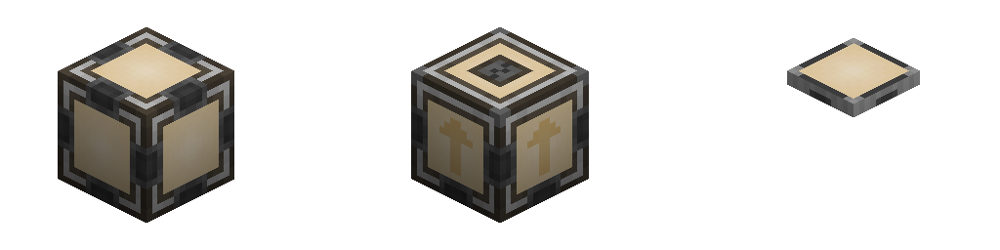

---
navigation:
  parent: items-blocks-machines/items-blocks-machines-index.md
  title: Pattern Provider
  icon: pattern_provider
  position: 210
item_ids:
- ae2:pattern_provider
- ae2:cable_pattern_provider
---
# The Pattern Provider

Pattern providers are the primary way in which your autocrafting system interacts with the world. They push the ingredients in
their [patterns](patterns.md) to adjacent inventories, and items can be inserted into them in order to insert them into the network. Often
a channel can be saved by piping the output of a machine back into a nearby pattern provider (often the one that pushed the ingredients)
instead of using an <ItemLink id="import_bus" /> to pull the output of the machine into the network.

Of note, since they push the ingredients directly from the [crafting storage](./items-blocks-machines/crafting-storages.md) in a crafting CPU, they
never actually contain the ingredients in their inventory, so you cannot pipe out from them. You have to have the provider push
to another inventory (like a barrel) then pipe from that.

Also of note, the provider has to push ALL of the ingredients at once, it can't push half-batches. This is useful
to exploit.

Pattern providers have a special interaction with interfaces on [subnets](../ae2-mechanics/subnetworks.md): if the interface is unmodified (nothing in the request slots)
the provider will skip the interface entirely and push directly to that subnet's [storage](../ae2-mechanics/import-export-storage.md),
skipping the interface and not filling it with recipe batches, and more importantly, not inserting the next batch until there's space in storage.

Multiple pattern providers with identical patterns are supported and work in parallel.

Pattern providers will attempt to round-robin their batches to all of their faces, thus using all attached machines in parallel.

# Variants

Pattern Providers come in 3 different variants: normal, directional, and flat/[subpart](../ae2-mechanics/cable-subparts.md). This affects which specific sides they push
ingredients to, receive items from, and provide a network connection to.

- Normal pattern providers push ingredients to all sides, receive inputs from all sides, and, like most AE2 machines, act
like a cable providing network connection to all sides.

- Directional pattern providers are made by using a <ItemLink id="certus_quartz_wrench" /> on a normal pattern provider to change its
direction. They only push ingredients to the selected side, receive inputs from all sides, and specifically don't provide a network
connection on the selected side. This allows them to push to AE2 machines without connecting networks, if you want to make a subnetwork.

- Flat pattern providers are [cable subparts](../ae2-mechanics/cable-subparts.md), and so multiple can be placed on the same cable, allowing for compact setups.
They act similar to the selected side on a directional pattern provider, providing patterns, receiving inputs, and **not**
providing a network connection on their face.

Pattern providers can be swapped between normal and flat in a crafting grid.

# Settings

Pattern providers have a variety of modes:

- **Blocking Mode** stops the provider from pushing a new batch of ingredients if there are already
ingredients in the machine.
- **Lock Crafting** can lock the provider under various redstone conditions, or until the result of the
previous craft is inserted into that specific pattern provider.
- The provider can be shown or hidden on <ItemLink id="pattern_access_terminal" />s.

# Priority

Priorities can be set by clicking the wrench in the top-right of the GUI. In the case of several [patterns](patterns.md)
for the same item, patterns in providers with higher priority will be used over patterns in providers with lower priority,
unless the network does not have the ingredients for the higher priority pattern.

# Recipes

<RecipeFor id="pattern_provider" />
<RecipeFor id="cable_pattern_provider" />