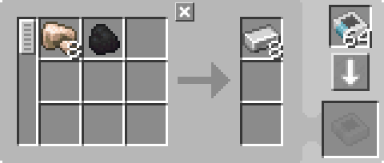

---
navigation:
  parent: items-blocks-machines/items-blocks-machines-index.md
  title: Pattern Provider
  icon: pattern_provider
  position: 210
categories:
- devices
item_ids:
- ae2:pattern_provider
- ae2:cable_pattern_provider
---

# The Pattern Provider

<Row gap="20">
<BlockImage id="pattern_provider" scale="8" />
<BlockImage id="pattern_provider" p:push_direction="up" scale="8" />
<GameScene zoom="8" background="transparent">
  <ImportStructure src="../assets/blocks/cable_pattern_provider.snbt" />
</GameScene>
</Row>

Pattern providers are the primary way in which your [autocrafting](../ae2-mechanics/autocrafting.md) system interacts with the world. They push the ingredients in
their [patterns](patterns.md) to adjacent inventories, and items can be inserted into them in order to insert them into the network. Often
a channel can be saved by piping the output of a machine back into a nearby pattern provider (often the one that pushed the ingredients)
instead of using an <ItemLink id="import_bus" /> to pull the output of the machine into the network.

Of note, since they push the ingredients directly from the [crafting storage](crafting_cpu_multiblock.md#crafting-storage) in a crafting CPU, they
never actually contain the ingredients in their inventory, so you cannot pipe out from them. You have to have the provider push
to another inventory (like a barrel) then pipe from that.

Also of note, the provider has to push ALL of the ingredients at once, it can't push half-batches. This is useful
to exploit.

Pattern providers have a special interaction with interfaces on [subnets](../ae2-mechanics/subnetworks.md): if the interface is unmodified (nothing in the request slots)
the provider will skip the interface entirely and push directly to that subnet's [storage](../ae2-mechanics/import-export-storage.md),
skipping the interface and not filling it with recipe batches, and more importantly, not inserting the next batch until there's space in the machine.
This works correctly with blocking mode, the provider will monitor the slots in the machine for ingredients, instead of the slots in the interface.

For example, this setup will push both the thing to be smelted and the fuel directly into the corresponding slots in the furnace.
You can use this to pattern provide into multiple sides of a machine, or multiple machines.

<GameScene zoom="6" background="transparent">
  <ImportStructure src="../assets/assemblies/furnace_automation.snbt" />

<BoxAnnotation color="#dddddd" min="1 0 0" max="2 1 1">
        (1) Pattern Provider: The directional variant, via use of a certus quartz wrench, with the relevant processing patterns.

        
  </BoxAnnotation>

<BoxAnnotation color="#dddddd" min="1 1 0" max="2 1.3 1">
        (2) Interface: In its default configuration.
  </BoxAnnotation>

<BoxAnnotation color="#dddddd" min="1 1 0" max="1.3 2 1">
        (3) Storage Bus #1: Filtered to coal.
        <ItemImage id="minecraft:coal" scale="2" />
  </BoxAnnotation>

<BoxAnnotation color="#dddddd" min="0 2 0" max="1 2.3 1">
        (4) Storage Bus #2: IFiltered to blacklist coal, using an inverter card.
        <Row><ItemImage id="minecraft:coal" scale="2" /><ItemImage id="inverter_card" scale="2" /></Row>
  </BoxAnnotation>

<DiamondAnnotation pos="4 0.5 0.5" color="#00ff00">
        To Main Network
    </DiamondAnnotation>

  <IsometricCamera yaw="195" pitch="30" />
</GameScene>

This is a general illustration of providing to multiple machines

<GameScene zoom="6" background="transparent">
<ImportStructure src="../assets/assemblies/provider_interface_storage.snbt" />

<BoxAnnotation color="#dddddd" min="2.7 0 1" max="3 1 2">
        Interface (must be flat, not fullblock)
  </BoxAnnotation>

<BoxAnnotation color="#dddddd" min="1 0 0" max="1.3 1 4">
        Storage Busses
  </BoxAnnotation>

<BoxAnnotation color="#dddddd" min="0 0 0" max="1 1 4">
        Places you want to pattern-provide to
  </BoxAnnotation>

<IsometricCamera yaw="185" pitch="30" />
</GameScene>

Multiple pattern providers with identical patterns are supported and work in parallel.

Pattern providers will attempt to round-robin their batches to all of their faces, thus using all attached machines in parallel.

## Variants

Pattern Providers come in 3 different variants: normal, directional, and flat/[subpart](../ae2-mechanics/cable-subparts.md). This affects which specific sides they push
ingredients to, receive items from, and provide a network connection to.

* Normal pattern providers push ingredients to all sides, receive inputs from all sides, and, like most AE2 machines, act
    like a cable providing [network connections](../ae2-mechanics/me-network-connections.md) to all sides.

* Directional pattern providers are made by using a <ItemLink id="certus_quartz_wrench" /> on a normal pattern provider to change its
    direction. They only push ingredients to the selected side, receive inputs from all sides, and specifically don't provide a
  [network connection](../ae2-mechanics/me-network-connections.md) on the selected side. This allows them to push to AE2 machines without connecting networks, if you want to make a subnetwork.

* Flat pattern providers are [cable subparts](../ae2-mechanics/cable-subparts.md), and so multiple can be placed on the same cable, allowing for compact setups.
    They act similar to the selected side on a directional pattern provider, providing patterns, receiving inputs, and **not**
    providing a [network connection](../ae2-mechanics/me-network-connections.md) on their face.

Pattern providers can be swapped between normal and flat in a crafting grid.

## Settings

Pattern providers have a variety of modes:

*   **Blocking Mode** stops the provider from pushing a new batch of ingredients if there are already
    ingredients in the machine.
*   **Lock Crafting** can lock the provider under various redstone conditions, or until the result of the
    previous craft is inserted into that specific pattern provider.
*   The provider can be shown or hidden on <ItemLink id="pattern_access_terminal" />s.

## Priority

Priorities can be set by clicking the wrench in the top-right of the GUI. In the case of several [patterns](patterns.md)
for the same item, patterns in providers with higher priority will be used over patterns in providers with lower priority,
unless the network does not have the ingredients for the higher priority pattern.

## A Common Misconception

For some reason people keep doing this, I don't understand why, but I'm putting this here to hopefully help. (Perhaps
people are mistaken, thinking an <ItemLink id="export_bus" /> is the only way for things to exit the network, not knowing
that pattern providers also export things)

This will not do what you want it to do. As mentioned in [cables](cables.md), cables are not item pipes, they have no internal
inventory, providers will not push into them.

<GameScene zoom="8" background="transparent">
  <ImportStructure src="../assets/assemblies/provider_misconception_1.snbt" />

  <BoxAnnotation color="#dddddd" min="1 0 3" max="2 1 4">
        Not A Blast Furnace
  </BoxAnnotation>

  <IsometricCamera yaw="95" pitch="5" />
</GameScene>

Since the provider doesn't have anything to push to, it will
not be able to function. All it's doing here is acting like a cable, connecting the <ItemLink id="export_bus" /> to the
network.

The provider will also not somehow tell the <ItemLink id="export_bus" /> what to export, the export bus will just export
everything you put in its filter.

What we've essentially done here is this:

<GameScene zoom="8" background="transparent">
  <ImportStructure src="../assets/assemblies/provider_misconception_2.snbt" />

  <BoxAnnotation color="#dddddd" min="1 0 3" max="2 1 4">
        Not A Blast Furnace
  </BoxAnnotation>

  <IsometricCamera yaw="95" pitch="5" />
</GameScene>

Likely what you would actually want to make is this, where the pattern provider can export the contents of its patterns to
the adjacent machine:

<GameScene zoom="8" background="transparent">
  <ImportStructure src="../assets/assemblies/provider_misconception_3.snbt" />

  <BoxAnnotation color="#dddddd" min="1 0 3" max="2 1 4">
        Not A Blast Furnace
  </BoxAnnotation>

  <IsometricCamera yaw="95" pitch="5" />
</GameScene>

## Recipes

<RecipeFor id="pattern_provider" />

<RecipeFor id="cable_pattern_provider" />
