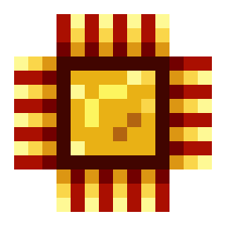
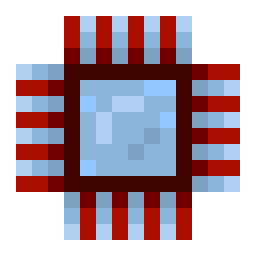

---
navigation:
  parent: items-blocks-machines/items-blocks-machines-index.md
  title: Processors
  icon: logic_processor
item_ids:
- ae2:logic_processor
- ae2:calculation_processor
- ae2:engineering_processor
- ae2:printed_silicon
- ae2:printed_logic_processor
- ae2:printed_calculation_processor
- ae2:printed_engineering_processor
- ae2:silicon
---
# Processors

  

Processors are one of the primary ingredients in AE2 devices and machines. They are also one of your first
big automation challenges. There are three types of processor, made with gold, <ItemLink id="certus_quartz_crystal" />,
and diamond respectively. They are made using [presses](presses.md) in an <ItemLink id="inscriber" />, in a multi-step
process (usually achieved via a series of inscribers and filtered piping).

# Production Steps

1. Gather/make the required ingredients: silicon, redstone, gold, <ItemLink id="certus_quartz_crystal" />, diamond.  

<RecipeFor id="silicon" />

2. Press the prerequisite printed circuit components

<RecipeFor id="printed_silicon" />
<RecipeFor id="printed_logic_processor" />
<RecipeFor id="printed_calculation_processor" />
<RecipeFor id="printed_engineering_processor" />

3. Final assembly

<RecipeFor id="logic_processor" />
<RecipeFor id="calculation_processor" />
<RecipeFor id="engineering_processor" />