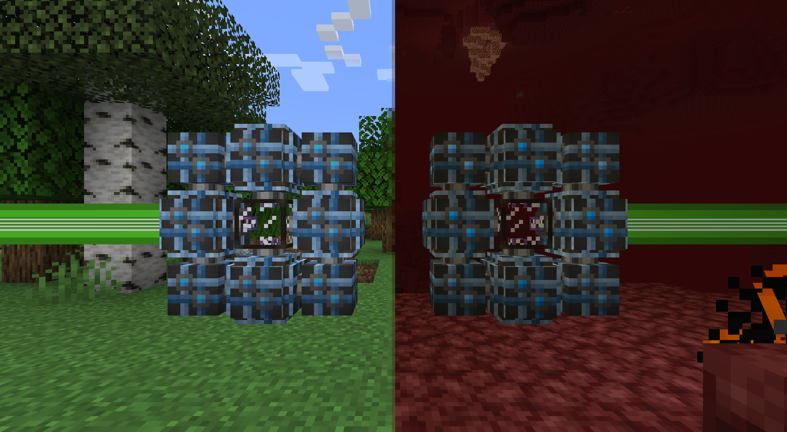

---
navigation:
  parent: items-blocks-machines/items-blocks-machines-index.md
  title: Quantum Bridge
  icon: quantum_ring
  position: 110
item_ids:
- ae2:quantum_link
- ae2:quantum_ring
---
# The Quantum Network Bridge

Quantum Network Bridges can extend a network over infinite distances and even between dimensions.
They can carry 32 channels in total (regardless of how cables are connected to each face), essentially
acting like a wireless [dense cable](cables.md).

Of note, **both sides must get power to initiate the connection**, then one side can send power through and power both rings.

Additionally, **both sides must be chunkloaded** so a <ItemLink id="spatial_anchor"/> or other chunkloader must be used
if the 2 sides are far apart.

# Quantum Ring

Eight of these blocks placed around a <ItemLink id="quantum_link"/> will create a
Quantum Network Bridge. Only the 4 <ItemLink id="quantum_ring"/> blocks adjacent to
the <ItemLink id="quantum_link" /> will accept network connections,
the 4 corner blocks cannot connect to cables.

# Recipe

<RecipeFor id="quantum_ring" />

# Quantum Link Chamber

One of these blocks surrounded by a <ItemLink id="quantum_ring"/>
will create a Quantum Network Bridge. This block doesn't connect to any cables and only registers
as part of the network with the full bridge is made.

This block's inventory can only hold a single <ItemLink id="quantum_entangled_singularity"/> and is
automation accessible.

# Recipe

<RecipeFor id="quantum_link" />