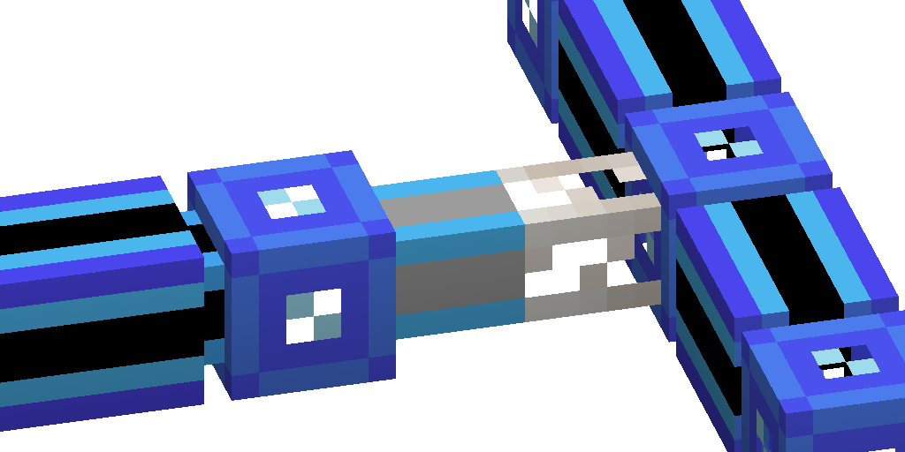

---
navigation:
  parent: items-blocks-machines/items-blocks-machines-index.md
  title: Quartz Fiber
  icon: quartz_fiber
  position: 110
item_ids:
- ae2:quartz_fiber
---
# The Quartz Fiber

The quartz fiber is used to share power between networks, while keeping them separate. This allows you to power
[subnetworks](../ae2-mechanics/subnetworks.md)
without needing to put energy acceptors and power cables everywhere. It can also be used to keep cables from connecting,
although using cables of differing colors, or using <ItemLink id="cable_anchor" /> is cheaper and more effective.

They are [cable subparts](../ae2-mechanics/cable-subparts.md).

# Recipe

<RecipeFor id="quartz_fiber" />