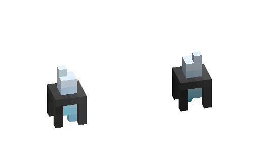

---
navigation:
  parent: items-blocks-machines/items-blocks-machines-index.md
  title: Quartz Fixtures
  icon: quartz_fixture
item_ids:
- ae2:quartz_fixture
- ae2:light_detector
---
# Quartz Fixtures

The charged quartz fixture is a little greeble that emits light.

The light detecting fixture instead emits a redstone signal according to the light level of its block.

# Recipe

<RecipeFor id="quartz_fixture" />
<RecipeFor id="light_detector" />
